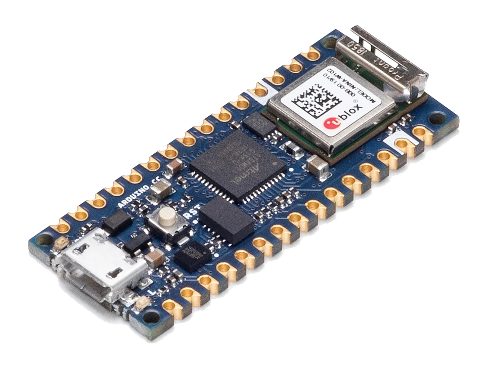
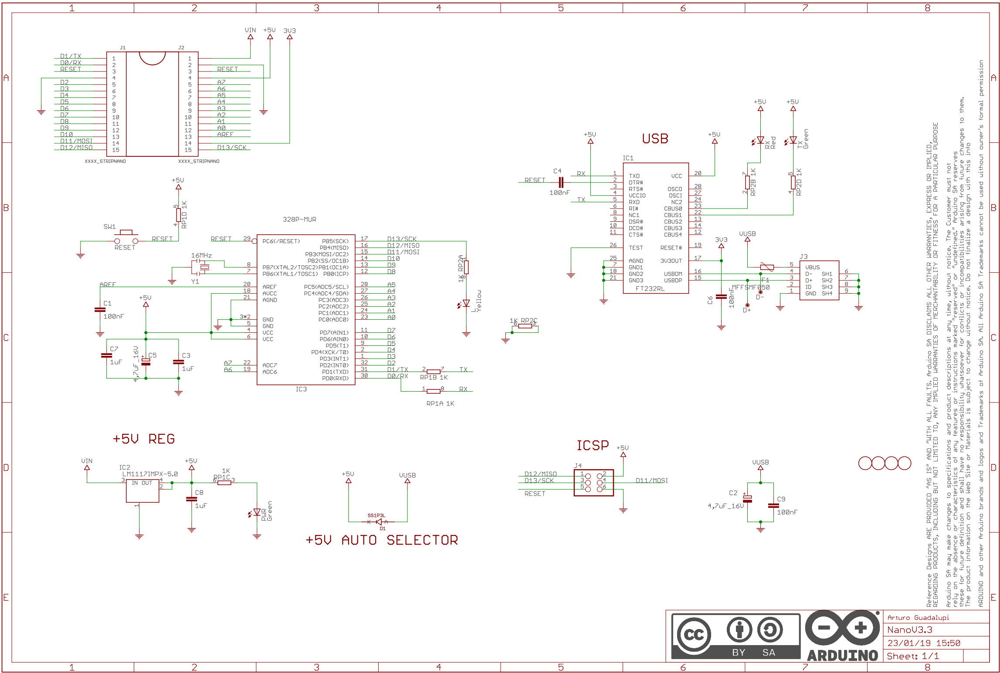

# 1.1. Wat is Arduino

Arduino is in de eerste plaats een bedrijf dat elektronische ontwikkelborden
en de bijhorende software ontwerpt, produceert en ondersteunt. Het doel van
Arduino is om mensen over de hele wereld op een eenvoudige manier toegang te
geven tot technologie die met de fysieke wereld kan interageren. De producten
van Arduino zijn bewust eenvoudig maar nog steeds krachtig gehouden, zodat ze bruikbaar
zijn voor een breed publiek: van studenten en hobbyisten ("makers") tot
professionele ontwikkelaars.

> "Arduino designs, manufactures, and supports electronic devices and
> software, allowing people around the world to easily access advanced
> technologies that interact with the physical world. Our products are
> straightforward, simple, and powerful, ready to satisfy users' needs from
> students to makers and all the way to professional developers."
> — [arduino.cc/en/about](https://www.arduino.cc/en/about)

Arduino omvat dus twee grote onderdelen die we in dit hoofdstuk apart
bespreken: de **hardware** (de ontwikkelborden zelf) en de **software** (de
IDE en de Arduino core).

## 1.1.1 Arduino hardware

Arduino brengt verschillende families van ontwikkelborden op de markt, elk
met een eigen vormfactor en toepassingsgebied. Wat al die boards gemeen
hebben, is dat het hart van elk ontwerp dezelfde component is: de
**microcontroller**. Alle andere onderdelen op het board — de
voedingsregeling, de USB-aansluiting, de pinconnectoren en eventueel een
draadloze module — dienen er in wezen toe om die ene chip te voeden, te
programmeren en met de buitenwereld te verbinden. Wat de families
onderling onderscheidt, is dan ook vooral *welke* microcontroller er gebruikt
wordt en welke randcomponenten eromheen geplaatst zijn. Wat een
microcontroller precies is, komt in 1.2 uitgebreid aan bod.

**UNO-familie**
De bekendste en meest gebruikte boards, waaronder de Arduino UNO R4 Minima,
UNO R4 WiFi, UNO R3, Leonardo, UNO Mini Limited Edition, Micro, Zero en UNO
WiFi Rev2. Dit zijn de boards waarmee de meeste mensen kennismaken wanneer ze
starten met Arduino.

**Nano-familie**
Compacte boards, geschikt voor projecten waar weinig plaats is. Voorbeelden
zijn de Arduino Nano 33 IoT, de Arduino Nano RP2040 Connect, de Arduino Nano
ESP32, de Arduino Nano 33 BLE Sense, de Arduino Nano 33 BLE, de Arduino Nano
Every, de "klassieke" Arduino Nano en de Arduino Nano Motor Carrier.



*Een Arduino Nano 33 IoT*

**GIGA-familie**
Krachtige boards, uitgerust met een dual-core microcontroller (STM32H747),
gericht op prestaties en multimedia-toepassingen. Voorbeeld is de Arduino
GIGA R1 WiFi, vaak gecombineerd met het bijhorende Arduino GIGA Display
Shield voor grafische toepassingen.

Een belangrijke kanttekening hierbij: het huidige aanbod op de website van
Arduino toont enkel de actueel verkochte boards, en houdt dus geen rekening
met de lange geschiedenis van Arduino-boards die ondertussen (deels) uit
productie zijn. In deze opleiding gebruiken we bijvoorbeeld nog regelmatig
de "klassieke" **Arduino Nano V3.0**, gebouwd rond een **ATmega328P**-
microcontroller. Deze chip is minder krachtig dan de nieuwere boards, maar
leent zich uitstekend om de **interne werking van een 8-bits
microcontroller** te leren kennen — niet enkel de basiseigenschappen, maar
ook hoe je op registerniveau (zoals `DDRB` en `PORTB`, zie 1.5) rechtstreeks
met de hardware communiceert.

### Arduino-compatibele boards

Naast de officiële Arduino-boards bestaan er ook talrijke **Arduino
compatible** boards van andere fabrikanten. Deze boards zijn niet
geproduceerd door Arduino zelf, maar kunnen wel via de Arduino IDE
geprogrammeerd worden en gebruiken dezelfde software-abstractie (de Arduino
core, zie verder). Dit is mogelijk doordat het ontwerp van Arduino-boards
open-source is (zie verder in dit hoofdstuk), waardoor derde partijen
gelijkaardige of afgeleide boards kunnen bouwen. Het board dat we in dit vak
gebruiken — de DFRobot FireBeetle 2, zie verder — is een voorbeeld van zo'n
Arduino-compatibel board. Hetzelfde geldt trouwens voor boards gebaseerd op
de ESP32: Espressif zelf produceert voornamelijk de onderliggende chip en
module (zoals de ESP32-WROOM-32E), en veel minder een uitgebreid gamma aan
afgewerkte ontwikkelborden. Andere fabrikanten — zoals DFRobot met de
FireBeetle 2 — bouwen zelf een board rond zo'n module. Dat zo'n board
alsnog via de Arduino IDE geprogrammeerd kan worden, komt doordat Espressif
een eigen Arduino core-implementatie voor de ESP32 onderhoudt (de
implementatie van alle gekende Arduino-functies zoals `pinMode()` en
`digitalWrite()`, maar dan voor ESP32-hardware) en deze vrij ter beschikking
stelt, zodat elke fabrikant die op zijn eigen ESP32-gebaseerde board kan
toepassen.

Omdat het ontwerp van de Arduino boards open-source is, is het relatief eenvoudig om zelf een
Arduino(-compatible) board te ontwerpen en te produceren. Vooral de Chinese
markt heeft hier gretig op ingespeeld: van klassiekers zoals de Arduino Uno
of Nano circuleren intussen talloze goedkope kloons en varianten. Deze
kloons zijn functioneel meestal niet slechter dan de originele boards, maar
vaak wel **minder stabiel en robuust**: sommige goedkope varianten laten
bijvoorbeeld bepaalde beveiligingen weg (zoals een fuse tegen kortsluiting of
overstroom), of gebruiken een minder betrouwbare USB-naar-UART-chip.

Toch is het voor een beginnende embedded-ontwikkelaar vaak net verstandig om
te starten met zo'n goedkoop, Chinees (compatible) board. Tijdens het
leerproces gebeurt het namelijk wel vaker dat je een board verkeerd
aansluit en zo per ongeluk laat doorbranden — en dan is het uiteraard
minder erg om een board van een paar euro te verliezen dan een duurder,
origineel Arduino-board.



*Het opensource schema van de Arduino Nano V3.3*

## 1.1.2 De Arduino IDE (software)

Om code te schrijven en naar een board te versturen, gebruik je de **Arduino
IDE** (Integrated Development Environment), de ontwikkelingsomgeving van
Arduino.

- De huidige versie (Arduino IDE 2.x) is gebouwd op **Electron**, een
  framework waarmee desktopapplicaties met webtechnologieën (HTML, CSS,
  JavaScript) gemaakt worden.
- Deze versie is nog relatief nieuw: de eerste stabiele release van IDE 2.0.0
  verscheen op 14 september 2022, als volledige herwerking van de vorige
  IDE, met een moderne gebruikersinterface en een volledig herziene backend
  gebaseerd op de Arduino CLI.
- De IDE is **open source**, wat betekent dat de broncode vrij te bekijken,
  te wijzigen en te hergebruiken is.

Zorg er bij de installatie voor dat je steeds de **laatste versie** van de
Arduino IDE gebruikt. Oudere versies missen soms ondersteuning voor recentere
boards (waaronder ESP32-gebaseerde boards) of bevatten bugs die intussen
opgelost zijn.

## 1.1.3 De Arduino core (software)

De **Arduino core** is een abstractielaag die bovenop de eigenlijke
microcontroller-hardware ligt. Deze laag zorgt ervoor dat je als
programmeur niet rechtstreeks met de registers van de microcontroller moet
werken, maar gebruik kan maken van eenvoudige, leesbare functies zoals
`pinMode()`, `digitalWrite()` en `digitalRead()`. Deze abstractielaag
bestaat voor een beperkt aantal microcontrollerfamilies.

Om het verschil te illustreren, bekijken we hetzelfde stukje functionaliteit
op twee manieren: eenmaal met directe registermanipulatie, en eenmaal met de
Arduino core.

**Zonder Arduino core (rechtstreekse registermanipulatie):**

```cpp
#include <avr/io.h>
#include <util/delay.h>

int main(void) {
  DDRB = 0b00000100;        // configure PB2 (pin 10) as output

  while (1) {
    PORTB = 0b00000100;     // set PB2 HIGH
    _delay_ms(500);         // wait 500 ms
    PORTB = 0b00000000;     // set PB2 LOW
    _delay_ms(500);         // wait 500 ms
  }

  return 0;
}
```

Merk op dat hier geen `setup()` en `loop()` te bekennen zijn: die twee
functies zijn geen eigenschap van de microcontroller, maar van de Arduino
core. Zonder die abstractielaag is er enkel een klassieke
`main()`-functie, met daarin een oneindige lus die de programmeur zelf
voorziet. Ook `delay()` valt weg en wordt vervangen door `_delay_ms()` uit
de AVR-bibliotheken.

**Met de Arduino core:**

```cpp
void setup() {
  pinMode(10, OUTPUT);
}

void loop() {
  digitalWrite(10, 1);  // set pin 10 (PB2) HIGH
  digitalWrite(10, 0);  // set pin 10 (PB2) LOW
  delay(1);             // wait 1 ms after each pulse
}
```

Opvallend is dat hier **geen enkele `#include`** in staat, terwijl het vorige
voorbeeld er twee nodig had. Ook dat is het werk van de Arduino core. Een
Arduino-sketch is namelijk geen gewone C++-broncode: voor het compileren
wordt de sketch eerst door een voorverwerkingsstap gehaald, die er
automatisch `#include <Arduino.h>` bovenaan bij plaatst. In dat
`Arduino.h`-bestand zitten onder meer:

- de declaraties van de gekende functies zoals `pinMode()`,
  `digitalWrite()` en `delay()`;
- de constanten die daarbij horen, zoals `OUTPUT`, `HIGH` en `LOW`;
- de nodige verwijzingen naar de onderliggende hardwarebibliotheken van de
  specifieke microcontroller (zoals `avr/io.h` bij een AVR-chip).

Dezelfde logica verklaart meteen ook waarom de `main()`-functie ontbreekt:
die zit verstopt in de Arduino core zelf. Daar staat een `main()` die de
hardware initialiseert, eenmalig `setup()` oproept en vervolgens `loop()` in
een oneindige lus blijft herhalen. De abstractielaag neemt met andere woorden
niet alleen het registerwerk over, maar ook de volledige opstartstructuur van
het programma.

Beide stukjes code doen functioneel hetzelfde, maar de Arduino core-versie is
veel leesbaarder en vergt geen kennis van de onderliggende registers (zoals
`DDRB` en `PORTB`) van de specifieke microcontroller.

Deze eenvoud heeft echter wel een prijs: de **performantie**. Metingen met
een oscilloscoop tonen aan dat het rechtstreeks schrijven naar de registers
(`PORTB = ...`) een veel kortere pulsbreedte en hogere snelheid oplevert dan
het gebruik van `digitalWrite()`. In één voorbeeld bedraagt het tijdsverschil
tussen twee flanken slechts 68 ns bij registermanipulatie, tegenover 4,32 µs
bij gebruik van `digitalWrite()` — een factor van meer dan 60 keer trager
(bron: [deepbluembedded.com](https://deepbluembedded.com/arduino-port-manipulation-registers-example/)).
Dit verschil is te verklaren doordat `digitalWrite()` bij elke aanroep extra
controles en berekeningen uitvoert (zoals het opzoeken van het juiste
register op basis van het pinnummer), terwijl directe registertoegang die
overhead vermijdt. We komen hier in de volgende sectie op terug, want net
dit soort overwegingen ligt mee aan de basis van de keuze om later in dit
vak over te schakelen naar het ESP-IDF.

