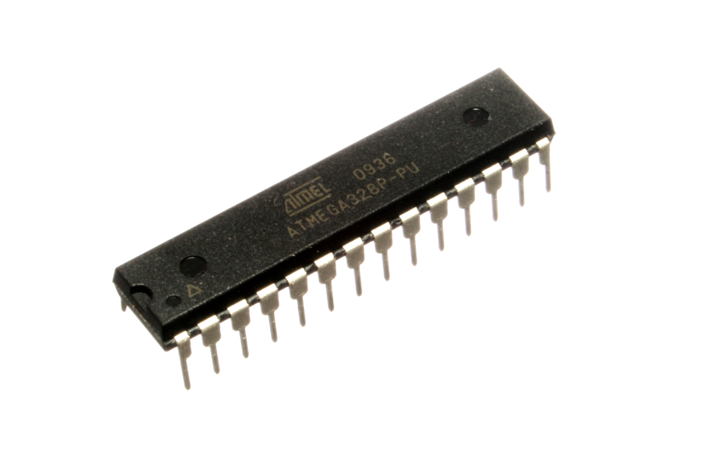
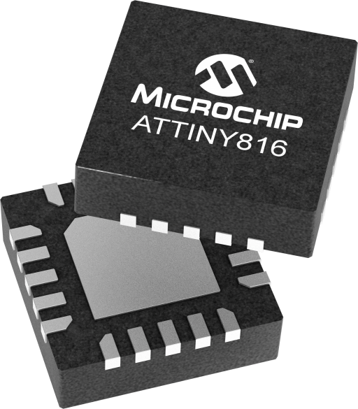
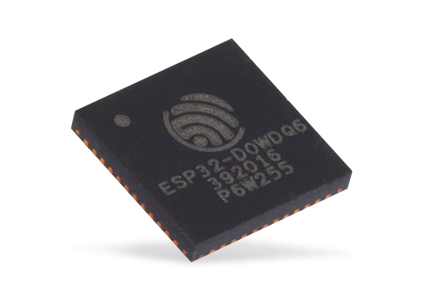
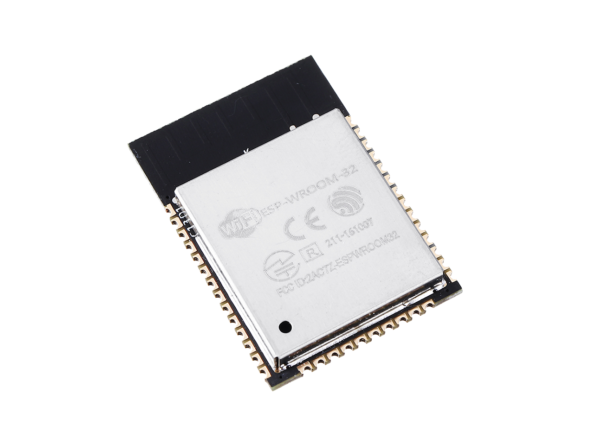
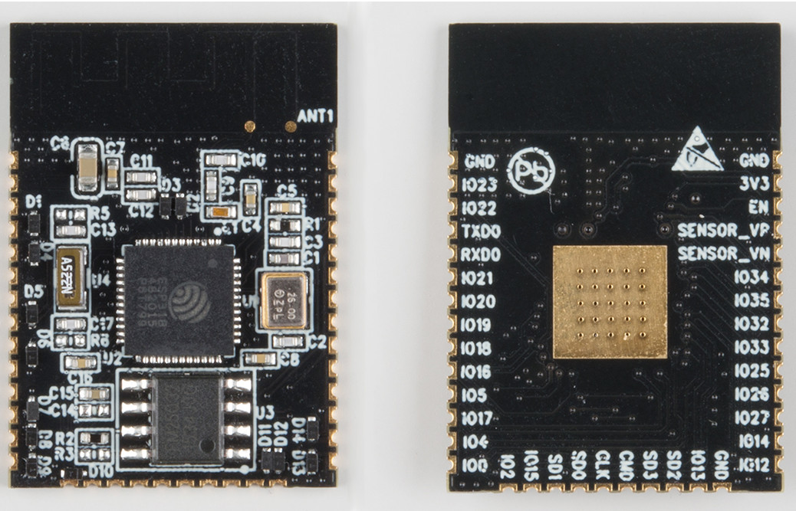
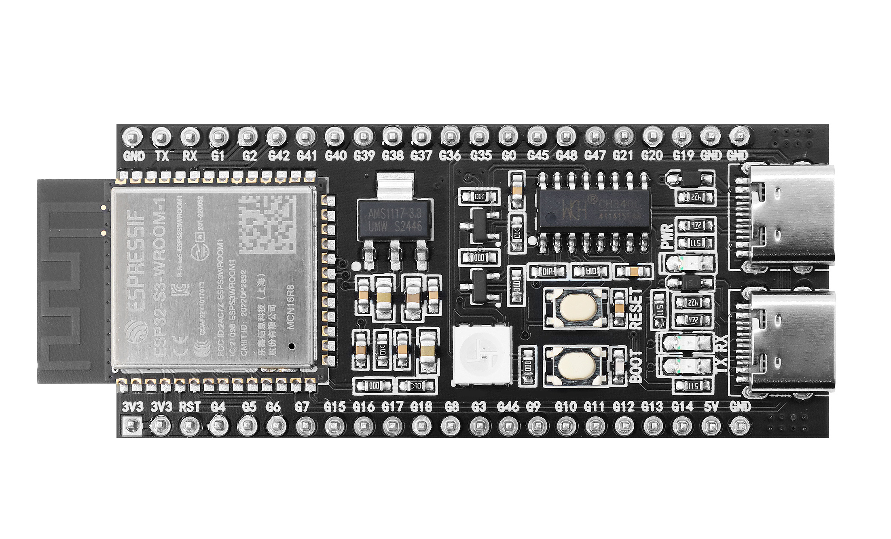

# 1.2. Wat is een microcontroller

Een microcontroller is in essentie een kleine minicomputer, maar met sterk
**beperkte hardware** in vergelijking met een gewone computer:

- De kloksnelheid wordt uitgedrukt in **MHz** in plaats van **GHz**.
- Het geheugen wordt uitgedrukt in **MB** (of zelfs KB) in plaats van **GB**.

Daarnaast heeft een microcontroller een **beperkte feature set**: er is geen
scherm, geen toetsenbord en geen muis aangesloten. Dit roept meteen de vraag
op: hoe wordt zo'n toestel dan geprogrammeerd?

## 1.2.1 Evolutie van de microcontroller: van 8051 tot ESP32

"De" microcontroller bestaat niet: het is een verzamelnaam voor chips met een
zeer uiteenlopende rekenkracht. Drie chips die doorheen dit hoofdstuk al aan
bod kwamen, illustreren mooi hoe die rekenkracht doorheen de decennia
geëvolueerd is:

| Chip                  | Periode    | Architectuur                   | Kloksnelheid     | Geheugen                           | Bijzonderheden                                                             |
|-----------------------|------------|--------------------------------|------------------|------------------------------------|----------------------------------------------------------------------------|
| **Intel 8051**        | sinds 1980 | 8-bit, CISC, Harvard           | doorgaans 12 MHz | 4 KB ROM, 128 byte RAM             | referentie-architectuur, tot vandaag nagebouwd door tientallen fabrikanten |
| **ATmega328P**        | sinds 2009 | 8-bit, RISC (AVR)              | tot 16 MHz       | 32 KB flash, 2 KB RAM, 1 KB EEPROM | 131 instructies, de meeste in 1 kloktik uitgevoerd (zie 1.2)               |
| **ESP32 (WROOM-32E)** | sinds 2016 | 32-bit, dual-core (Xtensa LX6) | < 240 MHz        | 520 KB SRAM + externe flash (MB's) | WiFi en Bluetooth standaard ingebouwd op de chip                           |

Van de 8051 naar de ATmega328P is vooral de **architectuur** vooruitgegaan:
van een complexe (CISC) naar een eenvoudigere, snellere instructieset (RISC),
waarbij de meeste instructies in één enkele kloktik worden uitgevoerd in
plaats van meerdere. Van de ATmega328P naar de ESP32 is de sprong veel
groter: van 8-bit naar 32-bit, van één naar twee kernen, en met draadloze
connectiviteit die standaard op de chip zelf aanwezig is — precies de
eigenschappen die in 1.3 de doorslag geven om in dit vak voor de ESP32 te
kiezen.

*Een ATmega328P IC* 

Dit verhaal mag echter niet gelezen worden als "nieuwer is altijd beter,
oudere chips verdwijnen". Eenvoudige 8-bit microcontrollers worden vandaag
nog steeds actief doorontwikkeld. Een goed voorbeeld is de **tinyAVR**
0-, 1- en 2-reeks** van Microchip (zoals de ATtiny402, ATtiny1614 of
ATtiny3216): een moderne 8-bit AVR-architectuur, geïntroduceerd vanaf
ongeveer 2016, dus ruim na de ATmega328P, en tot op vandaag verder uitgebreid.

Enkele redenen waarom zulke eenvoudige chips nog steeds hun plaats hebben:

- **Kostprijs**: een tinyAVR-chip kost in grote volumes vaak minder dan één
  euro — een fractie van de prijs van een ESP32-module. In
  massaproducten waar elke component meetelt in de kostprijs, weegt dat
  verschil zwaar door.
- **Energieverbruik**: minder features aan boord betekent doorgaans ook een
  lager stroomverbruik, zeker in slaapmodus — relevant voor
  batterijgevoede toepassingen die jarenlang moeten meegaan zonder
  batterijwissel.
- **Footprint**: deze chips zijn verkrijgbaar in piepkleine behuizingen (tot
  6 pinnen), wat ruimte bespaart in compacte ontwerpen.
- **Rechtgetrokken op de taak** (*right-sizing*): niet elke toepassing heeft
  WiFi, 32-bit rekenkracht of honderden kB's RAM nodig. Voor een taak zoals
  het uitlezen van een knop of het aansturen van een enkele LED is een
  krachtige 32-bit chip overgedimensioneerd — en dus economisch niet
  verantwoord.
- **Eenvoud en betrouwbaarheid**: minder complexe firmware betekent minder
  potentiële faalpunten, wat het ontwerp makkelijker deterministisch en
  eenvoudiger te certificeren maakt voor kritische toepassingen.

Het is dan ook niet ongewoon dat een "slim" product meerdere
microcontrollers van een verschillende klasse combineert: een krachtige
32-bit chip (zoals een ESP32) voor connectiviteit en gebruikersinterface,
naast één of meerdere kleine 8-bit chips die elk lokaal een specifieke,
deterministische deeltaak uitvoeren.

*Een ATtiny816 IC*

## 1.2.2 ESP32: microcontroller of system-on-chip?

Strikt genomen is een ESP32 geen "gewone" microcontroller, maar een
**system-on-chip (SoC)**: naast een configureerbare microcontroller-kern
(met de gekende randapparatuur zoals GPIO, timers en communicatiebussen)
integreert de chip ook radioperiferie voor **WiFi en Bluetooth**
rechtstreeks op dezelfde silicium. Dat onderscheid is meer dan een kwestie
van terminologie: het verklaart meteen waarom een ESP32 zoveel duurder en
complexer is dan een pure microcontroller zoals de ATmega328P, en waarom
die extra functionaliteit in 1.3 de doorslag geeft om er in dit vak mee te
werken.

*Een ESP SoC*

In de praktijk koopt men de kale SoC zelden apart, maar wel een
kant-en-klare **module**, zoals de ESP32-WROOM-32E. Zo'n module bevat naast
de SoC ook de nodige antenne, kristal en afscherming, en is al
**pre-gecertificeerd** voor de ingebouwde WiFi- en Bluetooth-zender (denk
aan FCC- en CE-radiocertificatie). Voor wie zelf een product op de markt
wil brengen, scheelt dat een dure en tijdrovende certificatiestap: de
radio-eigenschappen van de module liggen al vast, en enkel het eigen
ontwerp rond die module moet nog getest worden.

*Een ESP Module met een RF Shield*

*[Bron: Enginursday: First Impressions of the ESP32](https://news.sparkfun.com/2017)*

*Een ESP Module zonder een RF Shield*

## 1.2.3 Van chip tot development board

De vorige paragraaf maakte al het onderscheid tussen een kale **SoC** (de
chip zelf) en een **module** (de chip met antenne, kristal, afscherming en
radiocertificatie erbij). Een **development board** (zoals een Arduino of
een ESP32-devboard) bouwt daar nog een niveau bovenop: het is een
kant-en-klare print met een module of chip erop, waarbij alle pinnen op een
makkelijk toegankelijke header liggen en er ondersteunende hardware aan
toegevoegd is om meteen aan de slag te kunnen — zonder dat er zelf een print
ontworpen moet worden.

Eén van de belangrijkste taken van die ondersteunende hardware is het
programmeren van de chip mogelijk maken via een gewone USB-kabel, in plaats
van gespecialiseerde programmeerhardware. Hoe dat precies in zijn werk gaat,
komt in 1.2.4 aan bod.

## 1.2.4 Programmeren van een microcontroller

Om een microcontroller rechtstreeks te programmeren, is doorgaans
gespecialiseerde hardware nodig, zoals een AVR-programmer of een SEGGER
J-Link (een veelgebruikte debug- en programmeerprobe voor ARM-gebaseerde
chips). Deze toestellen verbinden zich via een aantal draden of een
JTAG/SWD-connector rechtstreeks met de programmeerpennen van de chip.

Arduino vereenvoudigt dit proces aanzienlijk. Op een Arduino-board zit
namelijk:

- Een **USB-to-UART-bridge**: een microcontroller begrijpt doorgaans geen
  USB, maar wel het eenvoudigere seriële UART-protocol. Een aparte chip
  (bijvoorbeeld de FT232RL, zoals te zien is op het schema van de Arduino
  Nano, of de CP2102, een andere veelgebruikte klassieker) vertaalt de
  USB-verbinding van de computer naar zo'n UART-verbinding.
- Een **spanningsregulator**: USB werkt op 5 volt, terwijl de meeste
  microcontrollers op 3,3 volt werken. Een lineaire voltageregulator op het
  board zet die 5 volt van de USB-poort om naar de 3,3 volt die de chip
  nodig heeft.
- Een **bootloader**: een klein programma dat al vooraf op de
  microcontroller staat geprogrammeerd en dat binnenkomende code via de
  seriële verbinding kan ontvangen en wegschrijven naar het geheugen van de
  chip.

Dankzij deze combinatie volstaat een simpele USB-kabel om code naar het board
te sturen — er is geen externe programmer nodig. Dit maakt het proces
**straightforward and simple**: rechttoe rechtaan en eenvoudig.

## 1.2.5 Interageren met de echte wereld

Microcontrollers zoals die van Arduino worden niet enkel in hobbyprojecten
gebruikt, maar liggen ook aan de basis van talloze toepassingen in de
industrie en in consumentenelektronica. Enkele voorbeelden ter illustratie:

- **Industriële en residentiële automatisering**: systemen zoals de Loxone
  Miniserver combineren een microcontroller met een groot aantal digitale
  en analoge in- en uitgangen (bijvoorbeeld 8 digitale ingangen op 24V, 4
  analoge ingangen van 0–10V en 4 analoge uitgangen van 0–10V) en een
  Ethernet-aansluiting, om gebouwen te automatiseren: verlichting,
  verwarming, rolluiken, enzovoort.
- **Consumentenelektronica**: ook een toestel als een magnetronoven (in dit
  geval van Whirlpool) wordt intern aangestuurd door een microcontroller,
  die het bedieningspaneel, het display en de verschillende
  kookprogramma's beheert.
- **Studentenprojecten met reële impact**: microcontrollers worden ook
  ingezet in projecten met een directe maatschappelijke toepassing, zoals
  een zelf ontworpen PCB die een zonne-aangedreven straatlantaarn aanstuurt
  in een ontwikkelingsproject in het buitenland. Zo'n board combineert
  typisch een ESP32-module, een batterij en het nodige vermogensbeheer op
  één eigen ontworpen printplaat.

Deze voorbeelden tonen aan dat de vaardigheden die in dit vak opgebouwd
worden — het aansturen van hardware met een microcontroller — rechtstreeks
toepasbaar zijn in zeer uiteenlopende contexten: van grootschalige
industriële systemen tot kleinschalige, op maat gemaakte oplossingen.