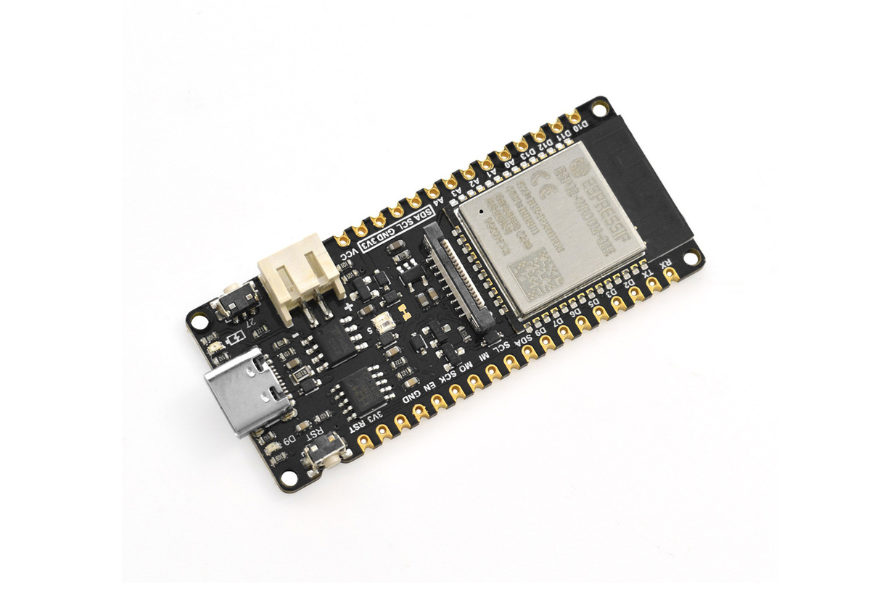
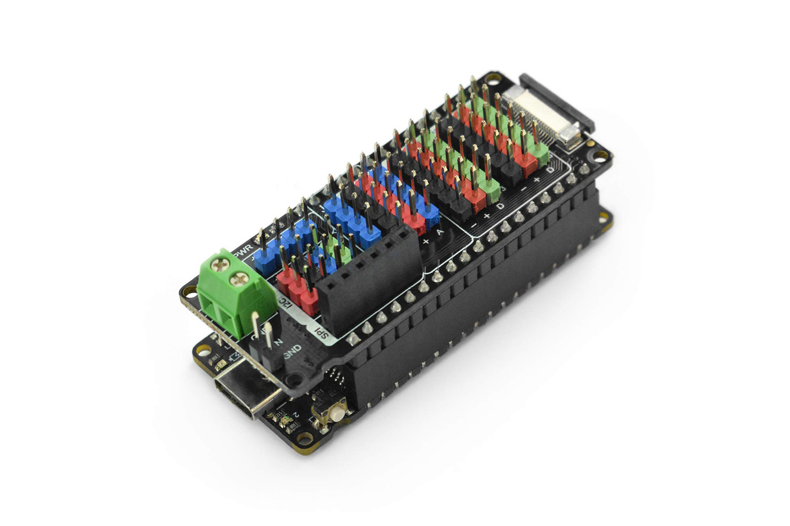

# 1.4 De hardware keuze

## 1.4.1 DFRobot FireBeetle 2

De FireBeetle is een reeks ontwikkelborden van de fabrikant **DFRobot**, een
Chinese leverancier van educatieve en embedded hardware. Naast de
FireBeetle-borden zelf brengt DFRobot ook een uitgebreid gamma aan
bijhorende uitbreidings- en sensormodules op de markt, verzameld onder de
naam **Gravity**.

Voor dit vak wordt specifiek de **FireBeetle 2** gebruikt. Die keuze steunt
op drie praktische overwegingen.

**Een ESP32 aan boord**

Het board is gebouwd rond een ESP32-module — precies de chip waarvoor in
1.3 gekozen werd. Dat is meteen ook de belangrijkste vereiste: elk ander
criterium hieronder is pas relevant nadat aan deze voorwaarde voldaan is.

**Een USB-C-aansluiting**

Een tweede reden is puur praktisch. Zou het labo verschillende types boards
voorzien, dan moeten er ook verschillende types kabels beschikbaar zijn
(USB-A-naar-Mini-B, -Micro-B, -C, ...). Kabels die in een labo rondslingeren,
verdwijnen bovendien vaak als sneeuw voor de zon — niet per se omdat ze
gestolen worden, maar omdat ze makkelijk eens meegenomen, kwijtgespeeld, of
voor iets anders gebruikt worden. Telkens opnieuw meerdere types kabels
moeten blijven aanvullen, is dan ook geen houdbare aanpak doorheen een heel
semester.

> **Opinie:** Het is ook een peroonlijk pet-peeve vanmezelf: ik heb graag maar een kabel nodig voor al mijn toestellen. Ik heb zelfs al puur voor deze redenen sommige van mijn persoonlijk elektronica vervangen door een USB-C variant, zelfs wanneer dit niet strikt noodzakelijk was.

Dat sluit ook aan bij de realiteit: weinig studenten lopen nog rond met een
USB Mini-B- of USB Micro-B-kabel, terwijl zo goed als iedereen ondertussen
een USB-C-kabel op zak heeft, hetzij USB-A-naar-C, hetzij USB-C-naar-C. Een
kleine nuance daarbij: een USB-C-naar-C-kabel is niet per definitie even
compatibel met elk toestel, aangezien de onderliggende USB-versie — en dus
de ondersteunde functies, zoals datasnelheid of vermogen — van kabel tot
kabel kan verschillen.

**Een breadboard-vriendelijke vormfactor**

Tot slot heeft de FireBeetle 2 een vormfactor die gelijkaardig is aan die
van de Arduino Nano V3.3 (zie 1.1): een compact board dat rechtstreeks op
een breadboard gestoken kan worden. Dat maakt het opbouwen van opstellingen
aanzienlijk eenvoudiger. Een Arduino Uno laat ook toe om draden op de
pinnen aan te sluiten, maar de compactere vormfactor van de Nano — en dus
ook van de FireBeetle 2 — maakt het net iets makkelijker om een volledige
opstelling samen op één breadboard te houden, en nadien in één beweging in
en uit de persoonlijke kit te steken.

## 1.4.2 DFRobot Gravity IO Expansion Shield

Naast de FireBeetle 2 zelf wordt in dit vak ook gebruikgemaakt van de
**Gravity IO Expansion Shield** van DFRobot. Dat is een uitbreidingsbordje
dat bovenop de microcontroller geplaatst wordt en de pinnen van het board
ontsluit via gestandaardiseerde **Gravity-aansluitingen**. Daardoor kunnen
andere DFRobot-modules eenvoudig aangesloten worden, zonder te solderen en
zonder een wirwar aan jumperdraden op een breadboard.

De shield voorziet onder meer digitale en analoge aansluitingen, alsook
aansluitingen voor de gangbare communicatiebussen zoals I²C, UART en SPI, en
een aparte voedingsingang voor een externe voedingsbron.

Een praktisch aandachtspunt: deze shield is specifiek ontworpen voor de
**FireBeetle 2-reeks** (ESP32-E en M0) en is dus niet geschikt voor het
oorspronkelijke FireBeetle-board. Bij het aankopen van eigen hardware is dat
een detail om op te letten.

### Sensoren uit het Gravity reeks

Het grote voordeel van deze aanpak is de brede keuze aan compatibele
sensoren en modules. In dit vak worden momenteel onder meer gebruikt:

- een **Time-of-Flight-afstandssensor**, die afstanden meet aan de hand van
  de looptijd van een uitgezonden lichtpuls;
- een **PIR-sensor** (*Passive Infrared*), die beweging detecteert door
  veranderingen in infraroodstraling op te merken.

Dit is slechts een kleine greep uit het aanbod: het Gravity-gamma bevat nog
tal van andere sensoren en actuatoren die in opstellingen van dit vak
inzetbaar zijn.

