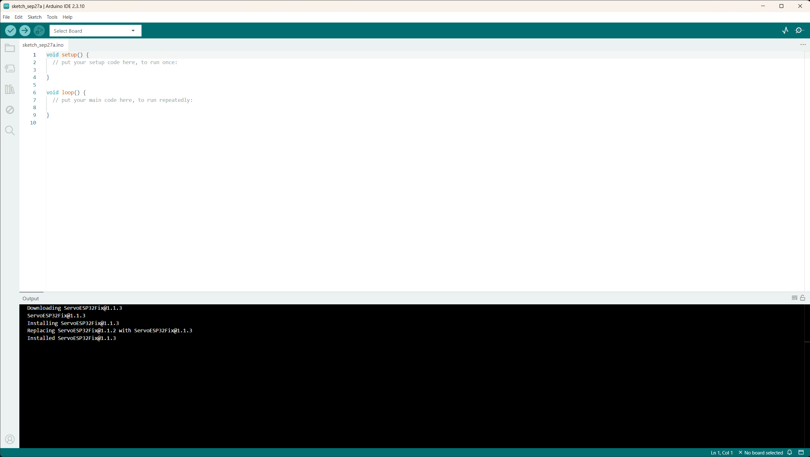

# 2.1 De Arduino IDE

De Arduino IDE (zie 1.1.2) is de omgeving waarin code geschreven, gecompileerd
en naar een board gestuurd wordt. Een korte rondleiding door de interface van
IDE 2.x:



**De werkbalk (bovenaan)**

- **Verify** (vinkje): compileert de sketch zonder die te uploaden. Handig om
  snel fouten in de code op te sporen.
- **Upload** (pijl): compileert de sketch en stuurt het resultaat naar het
  board.
- **Board- en poortkeuze** (dropdown naast de knoppen): hier wordt bepaald
  voor welk board gecompileerd wordt en via welke (COM-)poort het board
  bereikt wordt. Een verkeerd board of een verkeerde poort is veruit de
  meest voorkomende reden waarom een upload mislukt.
- **Serial Plotter** en **Serial Monitor** (rechtsboven): zie 2.2.

**De zijbalk (links)**

- **Sketchbook**: overzicht van de opgeslagen sketches.
- **Boards Manager**: hier worden cores voor extra boardfamilies
  geïnstalleerd (zie 2.3).
- **Library Manager**: hier worden bibliotheken (*libraries*) gezocht en
  geïnstalleerd, bijvoorbeeld voor een specifieke sensor of display.
- **Debug** en **Search**: debuggen (enkel op ondersteunde boards) en zoeken
  in de code.

**De editor (midden)**

Hier wordt de sketch geschreven. Een sketch bestaat minimaal uit:

```cpp
void setup() {
  // runs once at startup
}

void loop() {
  // runs repeatedly, forever
}
```

**Het onderste paneel**

- **Output**: toont de meldingen van de compiler en de uploader. Bij een
  fout staat hier de foutmelding, met het regelnummer waar het probleem zit.
- **Serial Monitor**: de communicatie tussen board en computer, zie 2.2.

**Een eerste upload**

Met een board aangesloten via USB komt een upload neer op drie stappen:

1. Het juiste **board** kiezen (bij een verse installatie is voor de
   ESP32 eerst de core nodig, zie 2.3).
2. De juiste **poort** kiezen. Als het board niet in de lijst verschijnt, is
   de USB-kabel vaak de oorzaak: sommige kabels voorzien enkel voeding en
   geen data.
3. Op **Upload** klikken en de Output opvolgen.
