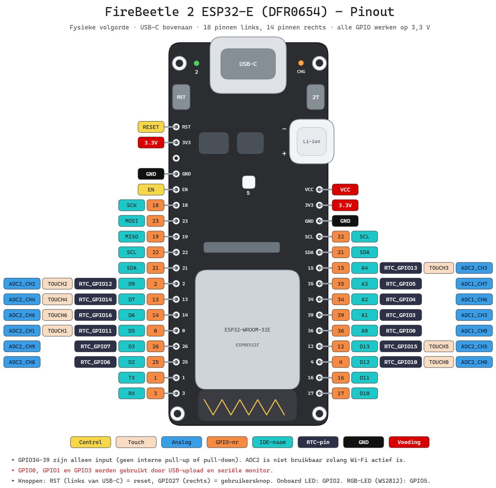

# 4.1 Wat is een GPIO

## 4.1.1 Het doel van een microcontroller: de fysieke wereld aansturen

Zoals eerder al aangehaald (zie [1.2.5 Interageren met de echte
wereld](../1_introductie/1.2_wat_is_een_microcontroller.md)), is het uiteindelijke doel van een
microcontroller niet het uitvoeren van berekeningen op zich, maar het
**aansturen en uitlezen van zaken uit de reële wereld**: een LED laten
branden, een motor laten draaien, een sensor uitlezen, een relais schakelen,
enzovoort.

Dit aansturen kan op twee manieren gebeuren:

- **Rechtstreeks**: de microcontroller stuurt het component onmiddellijk zelf
  aan, zonder tussenstap. Dit kan enkel wanneer het component werkt binnen de
  elektrische grenzen (spanning en stroom) die een GPIO-pin aankan — denk aan
  een kleine LED met voorschakelweerstand.
- **Via een tussenstap**: wanneer het component meer stroom of een andere
  spanning nodig heeft dan een GPIO-pin kan leveren (bijvoorbeeld een
  DC-motor, een relais of een sterke LED-strip), wordt een extra
  interfaceschakeling gebruikt, zoals een **motordriver**. De
  microcontroller stuurt in dat geval niet het component zelf aan, maar
  enkel de driver, die op zijn beurt met een externe voedingsbron het
  eigenlijke, krachtigere component aandrijft.

In beide gevallen gebeurt de aansturing vanuit de microcontroller op exact
dezelfde manier: door het **juiste elektrische signaal op een GPIO-pin te
zetten**. Of dat signaal nu rechtstreeks naar een LED gaat, of naar de
stuuringang van een motordriver, voor de microcontroller zelf maakt dat geen
verschil — het blijft simpelweg een pin op HIGH of LOW zetten, of een
PWM-signaal genereren. Deze sectie gaat dieper in op wat een GPIO-pin
precies is, en hoe bepaald wordt welke pin waarvoor gebruikt kan worden.

## 4.1.2 Vertrekpunt: de pinout van het ontwikkelbord

Om te weten welke pin gebruikt moet worden, wordt best niet vertrokken van de
pinout van de "kale" microcontroller-chip (in dit vak de ESP32-WROOM-32E),
maar van de **pinout van het ontwikkelbord** — in dit vak de DFRobot
FireBeetle 2 (zie [1.4.1 DFRobot
FireBeetle 2](../1_introductie/1.4_de_hardware_keuze.md)).

Daar zijn twee goede redenen voor:

- **Fysieke toegankelijkheid**: het is de connector/header van het
  ontwikkelbord die effectief aangeraakt en bedraad kan worden, niet de
  balletjes of pootjes van de chip zelf, die vaak onder een metalen
  afscherming verscholen zitten.
- **Herschikte pinnummers**: zoals al aangehaald, komt de pinnummering die
  in de Arduino IDE gebruikt wordt niet noodzakelijk overeen met het
  fysieke pinnummer op de chip (de "Port PIN"). DFRobot heeft deze pinnen
  intern hergemapt. Wie toch vanaf de chip-pinout vertrekt (bijvoorbeeld
  rechtstreeks uit het datasheet van de ESP32-WROOM-32E), loopt het risico
  de verkeerde pin aan te spreken in de code.

Het pinoutdiagram van het ontwikkelbord (vaak ook afgedrukt op de zijde van
het board zelf, of terug te vinden in de documentatie van de fabrikant) is
dus telkens het eerste referentiepunt, vóór in code een pin gekozen wordt.




Elke pin krijgt op dit diagram meerdere labels. Die labels lezen is een
basisvaardigheid voor de rest van het vak:

| Label        | Betekenis                                                                                                                                              |
| ------------ | ------------------------------------------------------------------------------------------------------------------------------------------------------ |
| **Control**  | pinnen om het board te resetten of uit te schakelen (`RST`, `EN`)                                                                                      |
| **Touch**    | pin met capacitieve touch-functie                                                                                                                      |
| **Analog**   | pin die verbonden is met een ADC-kanaal (bv. `ADC1_CH0`)                                                                                               |
| **Port PIN** | het GPIO-nummer van de chip zelf; dit nummer wordt in de code gebruikt                                                                                 |
| **IDE**      | het label op het board (`D2`, `A0`, ...), hergemapt door DFRobot                                                                                       |
| **RTC PIN**  | pin die in deep-sleep blijft werken en het board kan wekken                                                                                            |
| **GND**      | gemeenschappelijke massa van alle voedingen en signalen                                                                                                |
| **Power**    | voedingspinnen: `3V3` levert 3,3 V, `VCC` ongeveer 4,7 V bij voeding via USB of de batterijspanning (ongeveer 4 V) bij voeding via een Li-ion-batterij |

In de ESP32-core komt het pinnummer in code overeen met de **Port PIN**. De
pin met label `D2` is dus GPIO25, en wordt in code aangesproken als `25`.
Enkele voorbeelden uit het pinoutdiagram:

| IDE-label | Port PIN | In code | Opmerking                           |
| --------- | -------- | ------- | ----------------------------------- |
| `D2`      | GPIO25   | `25`    |                                     |
| `D3`      | GPIO26   | `26`    |                                     |
| `D6`      | GPIO14   | `14`    | ook touch-pin (`TOUCH6`)            |
| `D9`      | GPIO2    | `2`     | ook verbonden met de ingebouwde LED |
| `D12`     | GPIO4    | `4`     |                                     |
| `A0`      | GPIO36   | `36`    | enkel input, ADC-kanaal `ADC1_CH0`  |
| `A2`      | GPIO34   | `34`    | enkel input, ADC-kanaal `ADC1_CH6`  |
| `A4`      | GPIO15   | `15`    |                                     |

Opvallend: het label op het board en het nummer in code hebben vaak niets
met elkaar te maken. `D2` wordt geen `2`, maar `25`, en `A0` wordt `36`. Wie
`2` in code schrijft met de bedoeling pin `D2` aan te sturen, stuurt in
werkelijkheid de pin met label `D9` aan.

**Afspraak voor deze cursus**: in code wordt steeds het **Port PIN**-nummer
gebruikt, nooit het IDE-label. Daar zijn twee redenen voor:

- Het Port PIN-nummer is het nummer uit het datasheet van de ESP32 zelf, en
  blijft dus geldig op elk ander ESP32-ontwikkelbord. De IDE-labels zijn
  eigen aan de FireBeetle 2.
- Alle informatie over beperkingen (enkel input, strapping pin, ADC-kanaal,
  ...) in het datasheet en in de documentatie van Espressif verwijst naar het
  GPIO-nummer, niet naar het label op het board.

Om toch snel de juiste fysieke pin op het board terug te vinden, staat het
IDE-label telkens als commentaar naast het pinnummer:

```cpp
const int led_pin = 25;     // D2
const int button_pin = 14;  // D6
const int sensor_pin = 36;  // A0
```

## 4.1.3 General Purpose Input/Output

Een **GPIO** staat voor *General Purpose Input/Output*: een pin die — in
principe — vrij te configureren is als digitale ingang of als digitale
uitgang, naar keuze van de programmeur. Dit in tegenstelling tot een pin met
een vaste, vooraf bepaalde functie (zoals een voedingspin, die altijd enkel
spanning levert).

## 4.1.4 Digitaal versus "Analoog"

Een GPIO-pin werkt in essentie **digitaal**: de pin staat ofwel op HIGH
(werkspanning van het board, voor de FireBeetle 2 dus 3,3V), ofwel op LOW
(0V). Er bestaat geen "echte" analoge uitgang op een GPIO-pin.

Toch kan een GPIO-pin ook op twee manieren iets "analoogs" benaderen:

- **Als uitgang**: via **PWM** (*Pulse Width Modulation*, zie
  [4.6](./4.6_pwm.md)). Dit is geen echte analoge spanning, maar een snel schakelend
  digitaal signaal waarvan de gemiddelde spanning — door de *duty cycle* te
  variëren — een analoog effect nabootst.
- **Als ingang**: via de ingebouwde **ADC** (*Analog to Digital Converter*)
  die op een beperkt aantal pinnen aanwezig is (zie [4.5](./4.5_analoge_input.md)). Hier wordt een
  écht analoog spanningsniveau (bijvoorbeeld van een sensor) omgezet naar een
  digitale waarde die de microcontroller kan verwerken.

Vandaar de aanhalingstekens rond "Analoog": een GPIO blijft in essentie een
digitale pin, maar kan met behulp van extra hardware (PWM-generator, ADC)
toch analoge signalen benaderen of inlezen.

## 4.1.5 Aansturen

Wanneer een pin geconfigureerd is als `OUTPUT` (zie [4.3](./4.3_digitale_output.md)), kan de
microcontroller er een signaal op zetten:

- Een **digitale** waarde (`HIGH` of `LOW`) via `digitalWrite()`.
- Een **PWM**-signaal via `analogWrite()`.

Dit is exact het signaal waarmee, zoals in 4.1.1 beschreven, de echte wereld
wordt aangestuurd: rechtstreeks (bijvoorbeeld een LED die aan- of uitgaat, of
dimt via PWM) of onrechtstreeks, als stuursignaal naar een tussenstap zoals
een motordriver (zie 4.1.7).

## 4.1.6 Uitlezen

Wanneer een pin geconfigureerd is als `INPUT` (zie [4.4](./4.4_digitale_input.md)), kan de
microcontroller net omgekeerd een signaal van buitenaf inlezen:

- Een **digitale** toestand (`HIGH` of `LOW`) via `digitalRead()`, bijvoorbeeld
  van een drukknop of een digitale sensor.
- Een **analoge** spanning via de ADC, bijvoorbeeld van een potentiometer of
  een analoge sensor (zie [4.5](./4.5_analoge_input.md)).

## 4.1.7 Rechtstreeks aansturen versus aansturen via een tussenstap

Een GPIO-pin kan slechts een **beperkte stroom** leveren of verdragen (op de
meeste microcontrollers gaat het over enkele tientallen milliampère per pin,
raadpleeg steeds het datasheet voor de exacte waarde) en werkt bovendien op
een vast, laag **logisch spanningsniveau** (3,3V op de FireBeetle 2).

Zolang het aan te sturen component binnen die grenzen blijft — zoals een LED
met een geschikte voorschakelweerstand — kan het **rechtstreeks** op een
GPIO-pin aangesloten worden.

Veel componenten die in de praktijk aangestuurd moeten worden, vragen echter
meer vermogen dan een GPIO-pin kan leveren, of werken op een andere spanning:

- Een **DC-motor** trekt doorgaans veel meer stroom dan een GPIO-pin
  aankan, en moet bovendien in twee richtingen kunnen draaien.
- Een **relais** heeft vaak een grotere schakelstroom nodig dan een GPIO
  rechtstreeks kan leveren.
- Een component dat op een **hogere spanning** werkt dan 3,3V of 5V (denk
  aan 12V of 24V-toestellen) kan sowieso niet rechtstreeks op een GPIO
  aangesloten worden.

In zulke gevallen wordt een **tussenstap** ingebouwd tussen de
microcontroller en het aan te sturen component: een aparte
interfaceschakeling die het "zware werk" op zich neemt, met een eigen,
externe voeding. Enkele voorbeelden:

- Een **motordriver** (bijvoorbeeld een L298N- of DRV8833-module) neemt een
  laagvermogen stuursignaal van de microcontroller aan, en schakelt daarmee
  een veel grotere stroom naar de motor, afkomstig van een externe
  voedingsbron.
- Een **relaismodule** of **MOSFET** laat toe om met een klein GPIO-signaal
  een veel groter vermogen (bijvoorbeeld een 230V-lamp) te schakelen.

Belangrijk om te onthouden: ook in deze constructie verandert er **niets**
aan de kant van de microcontroller. Die stuurt nog steeds gewoon een
GPIO-pin op HIGH/LOW of met een PWM-signaal aan — enkel gaat dat signaal nu
naar de stuuringang van de driver, in plaats van rechtstreeks naar het
component. De driver zorgt vervolgens voor de vertaalslag naar het vermogen
en de spanning die het eigenlijke component nodig heeft.

## 4.1.8 Maar toch niet zo general purpose

Ondanks de naam *General Purpose* Input/Output, is niet elke GPIO-pin op een
microcontroller effectief inzetbaar voor eender welke functie. Een aantal
voorbeelden, gebaseerd op de ESP32 die in dit vak gebruikt wordt:

- **Niet elke pin ondersteunt de ADC**: enkel een beperkt aantal pinnen is
  intern verbonden met een analoog-digitaalconvertor. Om een analoge
  spanning in te lezen, moet dus een pin uit die specifieke groep gekozen
  worden (zie de kolom "Analog" in de pinouttabel van de FireBeetle 2,
  4.1.2).
- **Sommige pinnen zijn enkel input**: een aantal GPIO's kan niet als
  uitgang geconfigureerd worden.
- **Sommige pinnen hebben een speciale rol bij het opstarten**
  (*strapping pins*): de toestand van die pin bij het inschakelen of
  resetten bepaalt bijvoorbeeld in welke modus de chip opstart. Deze pinnen
  gebruiken voor een ander doeleinde kan het board doen vastlopen bij het
  opstarten.
- **Sommige pinnen zijn intern al in gebruik**: bijvoorbeeld voor de
  communicatie met het ingebouwde flashgeheugen, en zijn daardoor niet
  vrij beschikbaar op het ontwikkelbord.
- **Sommige pinnen hebben extra, unieke functionaliteit**, zoals een
  capacitieve **touch**-functie of een rol als **RTC**-pin die de chip uit
  deep-sleep kan wekken (zie de kolommen "Touch" en "RTC PIN" in de
  pinouttabel, 4.1.2) — functionaliteit die niet op elke pin aanwezig is.

Een GPIO is dus "general purpose" in de zin dat vrij gekozen kan worden of
een pin een input of een output is, maar **niet** in de zin dat elke pin
exact dezelfde mogelijkheden heeft. Dit is meteen ook de reden waarom steeds
vertrokken wordt van de pinout van het specifieke ontwikkelbord (zie 4.1.2):
die pinout toont in één oogopslag welke bijkomende functionaliteit (Analog,
Touch, RTC, ...) elke individuele pin al dan niet heeft.

## 4.1.9 Wat bepaalt de functionaliteit van een pin?

De uiteindelijke functionaliteit van een pin wordt bepaald door een
combinatie van twee zaken:

- **De hardware**: intern is elke fysieke pin van de chip verbonden met een
  beperkt aantal mogelijke *peripherals* (GPIO, ADC, touch-sensor, RTC, UART,
  SPI, I²C, PWM-generator, ...). Welke peripherals op welke pin beschikbaar
  zijn, ligt vast in het ontwerp van de chip en is terug te vinden in het
  datasheet of, eenvoudiger, in de pinouttabel van het ontwikkelbord.
- **De software**: binnen de mogelijkheden die de hardware toelaat, bepaalt
  de programmeur — bijvoorbeeld via `pinMode()`, of door een specifieke
  peripheral-driver op te starten — welke van die mogelijke functies op een
  gegeven moment effectief actief is op die pin.

Voor in code een pin gekozen wordt, worden best steeds twee dingen
gecontroleerd aan de hand van de pinout van het ontwikkelbord: (1) heeft
deze pin de nodige functionaliteit (bijvoorbeeld ADC, om een analoge sensor
uit te lezen), en (2) is deze pin vrij van speciale beperkingen (strapping
pin, enkel input, intern reeds in gebruik, ...) die de toepassing in de weg
zouden zitten.

Hoe die combinatie van hardware en software in de chip precies
georganiseerd is, en waar die informatie te vinden is, komt aan bod in
[4.2 Welke pin kan wat?](./4.2_welke_pin_kan_wat.md).
