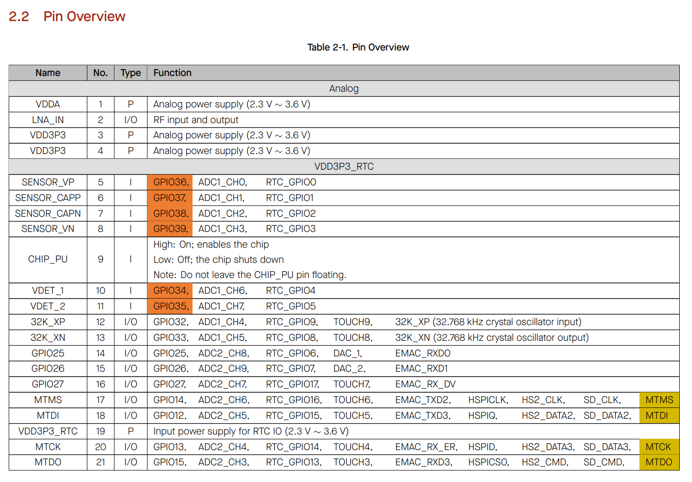
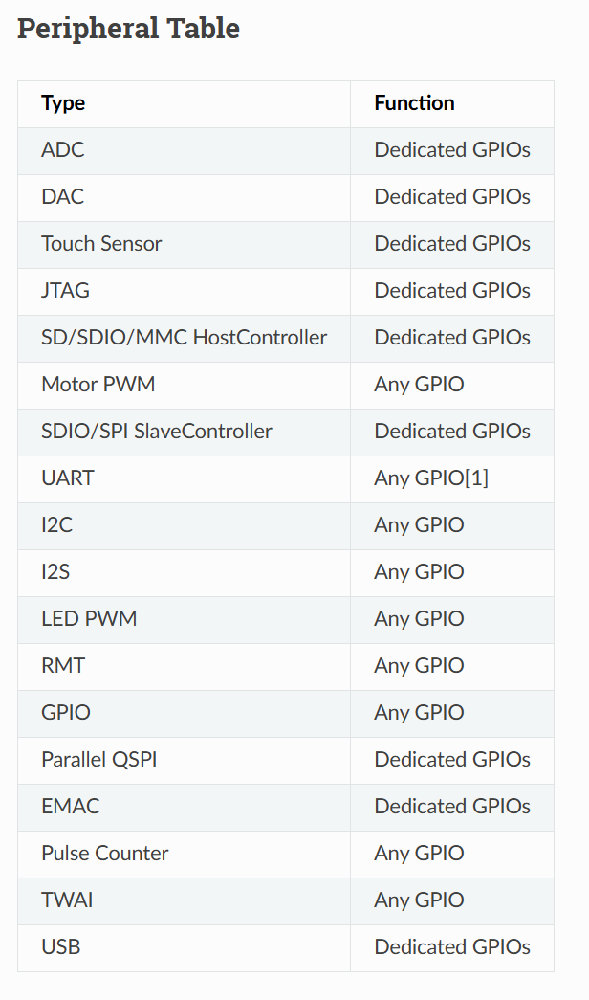
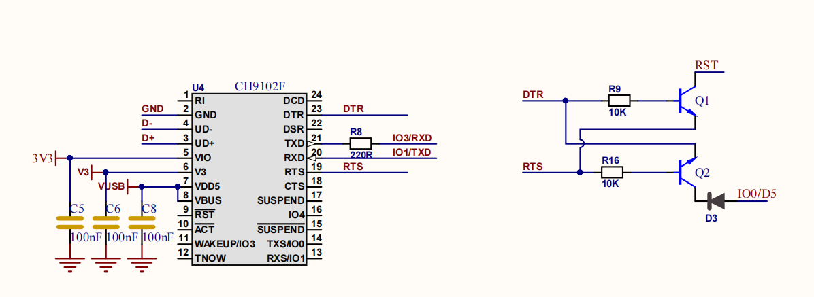
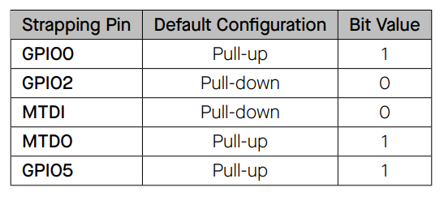
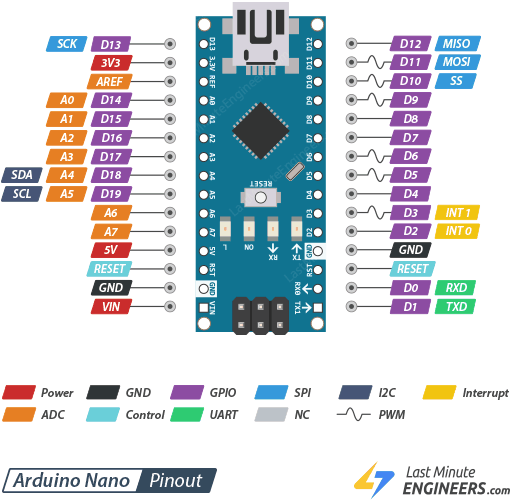

# 4.2 Welke pin kan wat?

In 4.1.9 bleek dat de functionaliteit van een pin bepaald wordt door de
hardware én de software. Deze sectie kijkt naar de hardwarekant: hoe een
chip een beperkt aantal pinnen verdeelt over een groot aantal interne
functies, waar die informatie te vinden is, en welke pinnen op de FireBeetle 2
beter met rust gelaten worden.

## 4.2.1 GPIO multiplexing

Een microcontroller bevat meer interne functies (*peripherals*) dan er
fysieke pinnen zijn. Een ESP32 heeft onder meer drie UART's, twee I²C-bussen,
meerdere SPI-bussen, 16 PWM-kanalen, twee ADC's, twee DAC-kanalen en tien
touch-kanalen. Voor al die functies samen zijn er maar 34 GPIO's beschikbaar.

De oplossing is **multiplexing**: elke pin is intern verbonden met een
schakelaar (een *multiplexer*, kortweg *mux*) die kiest welke peripheral op
dat moment met de pin verbonden is. De software stelt die mux in. Dat gebeurt
bijvoorbeeld wanneer `pinMode()` aangeroepen wordt, of wanneer een
I²C-bus gestart wordt op twee bepaalde pinnen.

Welke functies per pin mogelijk zijn, staat in een **multiplexing-tabel** in
het datasheet van de chip. Voor de ESP32 is dat de *Pin Overview* in het
[ESP32 datasheet](https://documentation.espressif.com/esp32_datasheet_en.pdf#page=14):

*Bron: Espressif, ESP32 Series Datasheet, Table 2-1 Pin Overview*

Per pin staan daar alle mogelijke functies naast elkaar: `GPIO32` kan
bijvoorbeeld ook `ADC1_CH4`, `TOUCH9` of `RTC_GPIO9` zijn. Een module zoals de
ESP32-WROOM-32E heeft een [eigen
tabel](https://documentation.espressif.com/esp32-wroom-32e_esp32-wroom-32ue_datasheet_en.pdf#page=11),
omdat de module een aantal pinnen van de chip zelf al gebruikt (bijvoorbeeld
voor het flashgeheugen) en de overige pinnen anders nummert.

### IO MUX en GPIO matrix

De ESP32 heeft een extra troef. Naast de klassieke vaste mux (de **IO MUX**)
bevat de chip ook een **GPIO matrix**: een soort schakelbord waarmee de
meeste *digitale* peripherals naar **eender welke** GPIO gerouteerd kunnen
worden. Een UART, I²C-bus of PWM-kanaal kan zo op bijna elke pin terechtkomen.

*Analoge* functies en functies die ook in deep-sleep moeten werken, kunnen
niet via die matrix. Die zitten vast op een bepaalde pin:

*Bron: [Arduino-ESP32 documentatie, GPIO Matrix and Pin
Mux](https://docs.espressif.com/projects/arduino-esp32/en/latest/tutorials/io_mux.html)*

| Vrij te kiezen pin (*Any GPIO*)                          | Vaste pin (*Dedicated GPIOs*)             |
| -------------------------------------------------------- | ----------------------------------------- |
| UART, I²C, I²S, LED PWM, RMT, pulse counter, gewone GPIO | ADC, DAC, touch, JTAG, SD/SDIO, EMAC, USB |

Daarom is de kolom **Analog** op de pinout van de FireBeetle 2 zo belangrijk:
een analoge sensor kan enkel op een pin die fysiek met een ADC-kanaal
verbonden is.

> **Let op:** niet elke microcontroller is zo flexibel. Op een klassieke
> ATmega328P (Arduino Nano) of een ATtiny liggen de meeste functies vast op
> één of hooguit twee pinnen. Het [datasheet van de
> ATtiny1616](https://ww1.microchip.com/downloads/en/DeviceDoc/40001912A.pdf#page=16)
> toont per pin een rij met alle mogelijke functies, en een beperkte
> *alternatieve* pin voor sommige peripherals. De vrijheid van de GPIO matrix
> is dus eerder uitzondering dan regel.

## 4.2.2 Lagen die de functionaliteit vastleggen

Wat de chip toelaat, is niet noodzakelijk wat het ontwikkelbord toelaat. Elke
laag tussen de chip en de header kan pinnen vastleggen:

- **De chip** bepaalt welke functies per pin mogelijk zijn (multiplexing-tabel).
- **De module** gebruikt een aantal pinnen zelf. Bij de ESP32-WROOM-32E zijn
  GPIO6 tot GPIO11 verbonden met het interne flashgeheugen en dus niet
  beschikbaar.
- **Het ontwikkelbord** verbindt pinnen met eigen hardware: de USB-UART-chip,
  een led, een knop, een batterijmeting, ... en brengt enkel een selectie van
  de overige pinnen naar de header.
- **De software** (core, libraries, eigen code) kiest uiteindelijk welke
  functie actief is.

De werkelijke functionaliteit van een pin zit dus verstopt in verschillende
lagen, zowel in hardware als in software. Wie zelf een PCB ontwerpt, heeft
hier meer vrijheid, maar ook meer verantwoordelijkheid. Twee praktische
vuistregels:

- Houd het eenvoudig en ga niet onnodig pinnen herrouteren. Een pinverdeling
  die rechtstreeks uit de standaardtabel komt, is makkelijker te begrijpen en
  te debuggen.
- Zijn er te weinig geschikte pinnen, dan is een chip of module met meer
  pinnen vaak een betere oplossing dan creatief multiplexen.

Een handig overzicht van welke ESP32-pinnen veilig te gebruiken zijn, staat
op [ESP32 Pinout Reference: Which GPIO pins should you
use?](https://randomnerdtutorials.com/esp32-pinout-reference-gpios/).

## 4.2.3 Pinnen met een vaste taak op de FireBeetle 2

Op de FireBeetle 2 zijn een aantal pinnen al door het board zelf in gebruik.
Het wordt sterk afgeraden om ze voor iets anders in te zetten.

### USB en programmeren: GPIO0, GPIO1 en GPIO3

De USB-UART-chip (een CH9102F) van het board is verbonden met:

- **GPIO1 (TX)** en **GPIO3 (RX)**: de seriële verbinding met de computer.
  Hierover loopt het uploaden van code, en ook alle output van
  `Serial.print()` en de logging uit 2.3.2.
- **GPIO0 (D5)** en **EN**: twee transistoren laten de computer het board
  automatisch in *download mode* zetten en resetten, zodat er niet op een
  knop gedrukt moet worden bij het uploaden.

Wie op deze pinnen een eigen schakeling aansluit, verstoort het uploaden of
de Serial Monitor.

### Strapping pins

Een **strapping pin** is een pin waarvan de toestand **op het moment van
opstarten of resetten** ingelezen wordt, om te bepalen hoe de chip opstart.
Daarna is het een gewone GPIO. De ESP32 heeft er vijf, elk met een interne
pull-up of pull-down die de standaardwaarde bepaalt (zie 4.4.4 voor wat een
pull-up en pull-down is):

| GPIO          | Label FireBeetle 2 | Bepaalt bij opstarten                           | Risico                                                                              |
| ------------- | ------------------ | ----------------------------------------------- | ----------------------------------------------------------------------------------- |
| GPIO0         | D5                 | normaal opstarten (HIGH) of download mode (LOW) | een knop of sensor die de pin LOW trekt, houdt het board in download mode           |
| GPIO2         | D9                 | download mode (samen met GPIO0)                 | op het board verbonden met de ingebouwde led; moet LOW of zwevend zijn bij download |
| GPIO5         | D8                 | timing van de SDIO-slave                        | op het board verbonden met de RGB-led                                               |
| GPIO12 (MTDI) | D13                | spanning van het flashgeheugen                  | HIGH bij opstarten zet de flash op 1,8 V: het board start niet meer op              |
| GPIO15 (MTDO) | A4                 | boodschappen bij opstarten                      | LOW bij opstarten onderdrukt de opstartlog in de Serial Monitor                     |

In de praktijk: een uitgang (led, trigger) op een strapping pin is meestal
geen probleem. Een ingang met een externe pull-up of pull-down, of een
module die de pin actief HIGH of LOW trekt, kan het opstarten wel verstoren.
Vooral **D13 (GPIO12)** verdient aandacht.

### Enkel input: GPIO34, 35, 36 en 39

De pinnen **A0 (GPIO36)**, **A1 (GPIO39)**, **A2 (GPIO34)** en **A3 (GPIO35)**
kunnen enkel als ingang gebruikt worden. Ze hebben bovendien **geen interne
pull-up of pull-down** (zie 4.4.5). Ze zijn wel ideaal voor analoge sensoren
(zie 4.5).

## 4.2.4 Oefening: pinout van de Arduino Nano

Het lezen van een pinout is niet specifiek voor de ESP32. Gebruik de pinout
van de Arduino Nano om de volgende vragen te beantwoorden.

*Bron: [Last Minute Engineers](https://lastminuteengineers.com/arduino-nano-pinout/)*

1. Heeft pin D9 meerdere functionaliteiten?
2. Op welke D-pinnen is de I²C-functionaliteit gekoppeld?
3. Kan op D8 een `analogRead()` uitgevoerd worden?

Oplossing

1. **Ja.** D9 is een gewone digitale I/O, maar ook een **PWM**-uitgang
   (het `~`-symbool; intern timer 1, `OC1A`). `analogWrite()` werkt dus op
   D9, maar niet op elke pin.
2. **Op geen enkele D-pin.** I²C zit op **A4 (SDA)** en **A5 (SCL)**. Die
   pinnen kunnen ook als digitale pin gebruikt worden, onder de naam D18 en
   D19. Op een Nano ligt I²C vast: de ATmega328P heeft geen GPIO matrix.
3. **Nee.** D8 (`PB0`) is niet verbonden met de ADC. Enkel A0 tot A7 hebben
   een ADC-kanaal. A6 en A7 kunnen bovendien *enkel* analoog ingelezen
   worden.

