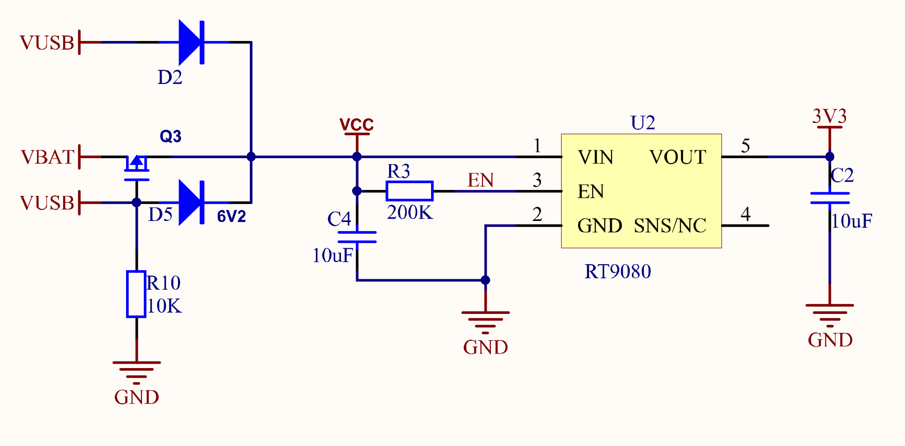
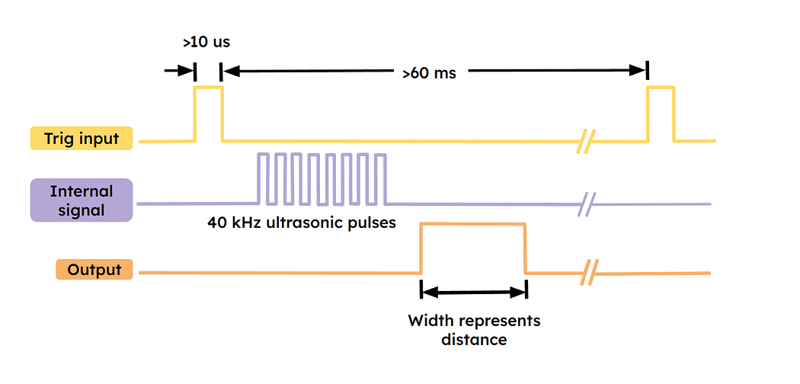
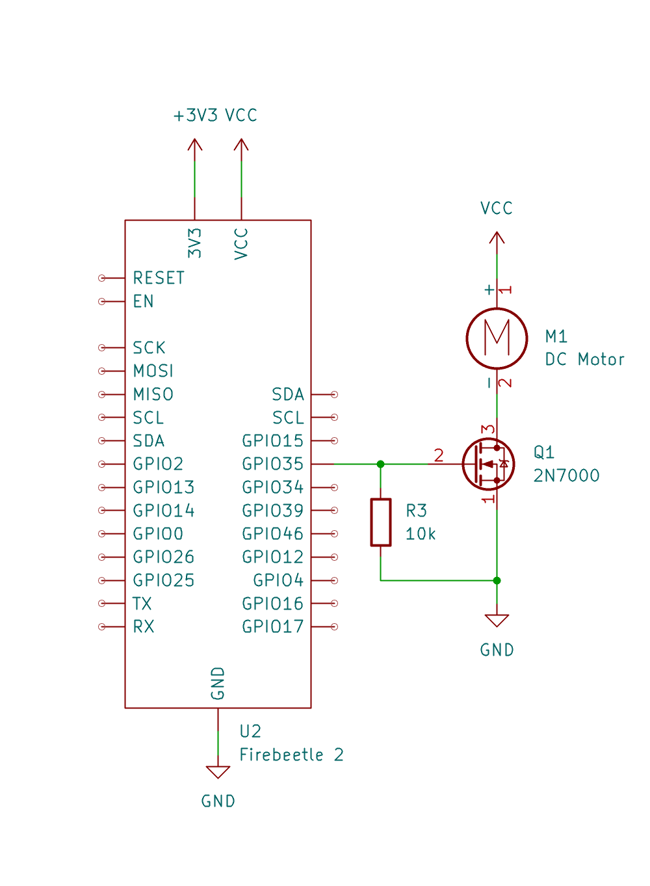

# 4.3 Digitale output

## 4.3.1 Een GPIO configureren

Voor een GPIO gebruikt kan worden, moet eerst bepaald worden of de pin een
**ingang** of een **uitgang** is. In de Arduino-wereld gebeurt dat met
`pinMode()`, meestal in `setup()`:

```cpp
const int led_pin = 2;       // D9, built-in LED
const int button_pin = 25;   // D2

void setup() {
  pinMode(led_pin, OUTPUT);
  pinMode(button_pin, INPUT);
}

void loop() {
  digitalWrite(led_pin, HIGH);
  int button_state = digitalRead(button_pin);
}
```

Het gebruik van een GPIO verloopt altijd in dezelfde stappen:

1. **De richting configureren**: `INPUT` of `OUTPUT` (en eventueel een
   pull-up of pull-down, zie 4.4.5).
2. **De functie aanroepen** die bij die richting past:
   - voor een uitgang: `digitalWrite()` of `analogWrite()`
   - voor een ingang: `digitalRead()` of `analogRead()`
3. Voor complexere functionaliteit (een I²C-sensor, een ledstrip, ...) wordt
   meestal een **library** gebruikt, die deze stappen zelf uitvoert.

> **Let op:** de richting moet passen bij wat de pin kan (zie 4.2.3). Een
> `pinMode(36, OUTPUT)` op A0 compileert zonder problemen, maar GPIO36 is
> enkel input: er komt nooit een spanning op die pin.

## 4.3.2 Een pin HIGH of LOW zetten

Eenmaal een pin als `OUTPUT` geconfigureerd is, zet `digitalWrite()` er een
spanning op:

- `HIGH`: de pin krijgt de **werkspanning** van de chip (3,3 V op de
  FireBeetle 2).
- `LOW`: de pin wordt verbonden met **0 V** (GND).

Het klassieke voorbeeld is een knipperende led op D10:

```cpp
const int led_pin = 17;      // D10
const int blink_delay_ms = 500;

void setup() {
  pinMode(led_pin, OUTPUT);
}

void loop() {
  digitalWrite(led_pin, HIGH);
  delay(blink_delay_ms);
  digitalWrite(led_pin, LOW);
  delay(blink_delay_ms);
}
```

## 4.3.3 Wat is de werkspanning van een ontwikkelbord?

`HIGH` betekent "de werkspanning", maar welke spanning is dat precies?

Een ontwikkelbord wordt meestal via **USB** met de computer verbonden. Die
verbinding zorgt niet enkel voor de data, maar ook voor de **voeding**. Een
standaard USB 2.0-poort levert **5 V** en maximaal **500 mA**.

Die 5 V is niet noodzakelijk de spanning waarop de microcontroller werkt:

- Een klassieke **Arduino Nano** (ATmega328P) werkt op **5 V**. Een `HIGH`
  is daar dus 5 V.
- De meeste moderne microcontrollers, waaronder de **ESP32**, werken op
  **3,3 V**. Een **spanningsregulator** (meestal een LDO, *low-dropout
  regulator*) op het board zet de 5 V van USB om naar 3,3 V (zie ook 1.2.4).



Op de FireBeetle 2 komen zo twee spanningen op de header terecht:

- **VCC**: de ingangsspanning, ongeveer 4,7 V bij voeding via USB (de 5 V
  min het spanningsverlies over een diode), of de batterijspanning bij
  voeding via een Li-ion-batterij.
- **3V3**: de uitgang van de regulator, en dus ook de spanning van een
  `HIGH` op elke GPIO.

> **Let op:** de GPIO's van de ESP32 zijn **niet 5 V-tolerant**. Een
> signaal van 5 V (bijvoorbeeld van een sensor die op VCC gevoed wordt) mag
> niet rechtstreeks op een ingang. Hoe dat opgelost wordt, komt aan bod in
> 4.4.3.

## 4.3.4 Hoeveel stroom mag een GPIO leveren?

Een GPIO is geen voeding. De uitgangstrap van een pin kan maar een beperkte
stroom leveren (*source*) of opnemen (*sink*):

|                           | Arduino Nano (ATmega328P) | ESP32                                       |
| ------------------------- | ------------------------- | ------------------------------------------- |
| Werkspanning              | 5 V                       | 3,3 V                                       |
| Aanbevolen stroom per pin | 20 mA                     | ongeveer 20 mA (standaard *drive strength*) |
| Absoluut maximum per pin  | 40 mA                     | 40 mA (source), 28 mA (sink)                |

Raadpleeg voor exacte waarden steeds het datasheet. Daarnaast geldt er ook
een maximum voor **alle pinnen samen**: tien leds van 20 mA tegelijk is dus
geen goed idee.

### Een led aansturen: source of sink

Een led wordt altijd in serie geschakeld met een **voorschakelweerstand**
die de stroom beperkt. Er zijn twee manieren om ze op een GPIO aan te
sluiten:

- **Current source**: GPIO → weerstand → led → GND. De pin *levert* de
  stroom. De led brandt bij `HIGH`.
- **Current sink**: 3V3 → weerstand → led → GPIO. De pin *neemt* de stroom
  op. De led brandt bij `LOW`: de logica is **omgekeerd** (*active low*).

Beide zijn correct. Een schakeling als current sink komt vaak voor bij
ingebouwde leds, en verklaart waarom een led soms net uitgaat bij
`digitalWrite(pin, HIGH)`.

De weerstand wordt berekend met de wet van Ohm. Voor een rode led
(doorlaatspanning V<sub>F</sub> ≈ 2,0 V) en een stroom van 10 mA op 3,3 V:

> R = (V<sub>GPIO</sub> − V<sub>F</sub>) / I = (3,3 V − 2,0 V) / 10 mA = **130 Ω**

In de praktijk wordt de eerstvolgende standaardwaarde gekozen: **150 Ω**.

## 4.3.5 Use cases

Een digitale uitgang is eenvoudig, maar wordt voor veel meer gebruikt dan
een led.

### Een trigger-signaal sturen

Veel sensoren starten een meting op een korte puls. De bekende
ultrasone afstandssensor **HC-SR04** start een meting wanneer de
`Trig`-ingang minstens **10 µs** HIGH is geweest:



*Bron: [Understanding Ultrasonic
Sensor](https://medium.com/@robotamateur123/understanding-ultrasonic-sensor-e3791f883061)*

```cpp
const int trigger_pin = 26;  // D3

void setup() {
  pinMode(trigger_pin, OUTPUT);
  digitalWrite(trigger_pin, LOW);
}

void start_distance_measurement() {
  digitalWrite(trigger_pin, HIGH);
  delayMicroseconds(10);
  digitalWrite(trigger_pin, LOW);
}
```

Het antwoord van de sensor (de `Echo`-puls) wordt ingelezen met een
digitale ingang, zie 4.4.7.

### Een MOSFET aansturen

Een DC-motor, een ledstrip of een solenoid vraagt veel meer stroom dan een
GPIO kan leveren (zie 4.1.7). Een **N-channel MOSFET** werkt hier als
elektronische schakelaar: de GPIO stuurt de *gate*, en de MOSFET schakelt
de stroom van de motor via een eigen voeding naar GND.



Aandachtspunten:

- De weerstand van **10 kΩ** tussen gate en GND houdt de MOSFET uit zolang
  de GPIO nog niet geconfigureerd is, bijvoorbeeld tijdens het opstarten.
- Kies een **logic-level MOSFET** die volledig geleidt bij 3,3 V op de gate
  (bijvoorbeeld een AO3400). Een 2N7000 werkt voor kleine stromen, maar
  heeft een drempelspanning tot 3 V en geleidt op 3,3 V maar gedeeltelijk.
- Een motor is een inductieve last: een **flyback diode** over de motor
  beschermt de MOSFET tegen spanningspieken bij het uitschakelen.
- Kies geen pin die enkel input is (GPIO34–39, zie 4.2.3).

### Meerdere leds aansturen met een for-lus

Vaak moeten meerdere uitgangen van hetzelfde type aangestuurd worden: een
rij leds, de segmenten van een display, een reeks relais, ... Elke pin een
eigen variabele geven en elke `pinMode()` en `digitalWrite()` apart
uitschrijven, wordt snel onoverzichtelijk. Beter is het om de pinnummers in
een **array** te bewaren en er met een **for-lus** over te lopen. Een extra
led toevoegen betekent dan enkel een extra getal in de array.

Het aantal elementen in de array wordt berekend met `sizeof` (zie 3.4.3).
Dat werkt hier, omdat de array in hetzelfde bestand gedeclareerd is en dus
nog geen pointer geworden is.

#### Een ledbar

Een **ledbar** is een rij leds naast elkaar, bijvoorbeeld om een niveau
weer te geven (volume, batterijlading, afstand, ...). Elke led heeft een
eigen voorschakelweerstand en een eigen GPIO.

```cpp
const int led_pins[] = {25, 26, 14, 13, 17};   // D2, D3, D6, D7, D10
const int led_count = sizeof(led_pins) / sizeof(led_pins[0]);
const int step_delay_ms = 200;

void setup() {
  for (int i = 0; i < led_count; i++) {
    pinMode(led_pins[i], OUTPUT);
  }
}

// Turn on the first 'level' leds, turn off the rest
void show_level(int level) {
  for (int i = 0; i < led_count; i++) {
    digitalWrite(led_pins[i], i < level ? HIGH : LOW);
  }
}

void loop() {
  for (int level = 0; level <= led_count; level++) {
    show_level(level);
    delay(step_delay_ms);
  }
}
```

De functie `show_level()` kan rechtstreeks gekoppeld worden aan een meting:
een potentiometer (zie 4.5) of een afstandssensor die omgerekend wordt naar
een getal tussen 0 en `led_count`.

> **Let op:** bij een ledbar branden veel leds tegelijk. Hou rekening met de
> maximale stroom voor alle pinnen samen (zie 4.3.4) en kies de
> voorschakelweerstanden eerder groot (bijvoorbeeld 10 mA of minder per
> led).

#### Een zevensegmentdisplay

Een **zevensegmentdisplay** bestaat uit zeven leds in de vorm van een 8,
de segmenten **a** tot **g** (en vaak nog een punt, *dp*). Bij een display
met **gemeenschappelijke kathode** (*common cathode*) hangen alle kathodes
samen aan GND, en brandt een segment bij `HIGH`. Bij een display met
**gemeenschappelijke anode** (*common anode*) hangen de anodes samen aan
3V3 en is de logica omgekeerd, net zoals bij een current sink.

```text
     a
   -----
  |     |
 f|     |b
  |  g  |
   -----
  |     |
 e|     |c
  |     |
   ----- 
     d
```

Welke segmenten moeten branden voor elk cijfer, wordt vastgelegd in een
**opzoektabel** (*lookup table*): een tweedimensionale array met één rij
per cijfer en één kolom per segment. Een for-lus overloopt daarna de
zeven segmenten.

```cpp
// Common cathode display: HIGH turns a segment on
const int segment_pins[] = {25, 26, 14, 13, 17, 16, 4};  // a, b, c, d, e, f, g
const int segment_count = sizeof(segment_pins) / sizeof(segment_pins[0]);
const int count_delay_ms = 1000;

// One row per digit, one column per segment (a to g)
const bool digit_segments[10][7] = {
  {1, 1, 1, 1, 1, 1, 0},  // 0
  {0, 1, 1, 0, 0, 0, 0},  // 1
  {1, 1, 0, 1, 1, 0, 1},  // 2
  {1, 1, 1, 1, 0, 0, 1},  // 3
  {0, 1, 1, 0, 0, 1, 1},  // 4
  {1, 0, 1, 1, 0, 1, 1},  // 5
  {1, 0, 1, 1, 1, 1, 1},  // 6
  {1, 1, 1, 0, 0, 0, 0},  // 7
  {1, 1, 1, 1, 1, 1, 1},  // 8
  {1, 1, 1, 1, 0, 1, 1},  // 9
};

void setup() {
  for (int i = 0; i < segment_count; i++) {
    pinMode(segment_pins[i], OUTPUT);
  }
}

void show_digit(int digit) {
  for (int i = 0; i < segment_count; i++) {
    digitalWrite(segment_pins[i], digit_segments[digit][i] ? HIGH : LOW);
  }
}

void loop() {
  for (int digit = 0; digit < 10; digit++) {
    show_digit(digit);
    delay(count_delay_ms);
  }
}
```

Aandachtspunten:

- Elk segment krijgt een **eigen weerstand**. Eén gedeelde weerstand in de
  gemeenschappelijke lijn zorgt ervoor dat een 1 feller brandt dan een 8.
- Bij een display met gemeenschappelijke anode volstaat het om `HIGH` en
  `LOW` in `show_digit()` om te wisselen.
- Een display met meerdere cijfers vraagt al snel te veel pinnen. Dan wordt
  een techniek als *multiplexing* gebruikt, of een driver-IC (zoals de
  MAX7219 of TM1637) die met enkele pinnen aangestuurd wordt.

### En nog veel meer

- Een **blokgolf** genereren, bijvoorbeeld voor een buzzer.
- IC's of modules **aan- en uitschakelen** via hun `EN`- of `CS`-pin.
- Een **relaismodule** aansturen.
- Een status weergeven op een of meerdere leds.

Zodra de pin niet enkel aan en uit moet, maar een tussenliggende waarde moet
benaderen (een led dimmen, de snelheid van een motor regelen), is **PWM**
nodig. Dat komt aan bod in 4.6.

## 4.3.6 Onder de motorkap: het ESP-IDF

Zoals in 2.3.2 bleek, roept `digitalWrite()` op de ESP32 uiteindelijk
`gpio_set_level()` uit het ESP-IDF aan. In het ESP-IDF zelf wordt een pin
geconfigureerd met een **configuratiestruct**. Daarin worden alle
instellingen van een of meerdere pinnen in één keer vastgelegd. Het
knipperende led-voorbeeld uit 4.3.2 ziet er in het ESP-IDF zo uit:

```c
#include "driver/gpio.h"
#include "freertos/FreeRTOS.h"
#include "freertos/task.h"

#define LED_GPIO GPIO_NUM_17   // D10
#define BLINK_DELAY_MS 500

void app_main(void) {
  gpio_config_t led_config = {
    .pin_bit_mask = 1ULL << LED_GPIO,
    .mode = GPIO_MODE_OUTPUT,
    .pull_up_en = GPIO_PULLUP_DISABLE,
    .pull_down_en = GPIO_PULLDOWN_DISABLE,
    .intr_type = GPIO_INTR_DISABLE,
  };
  ESP_ERROR_CHECK(gpio_config(&led_config));

  while (1) {
    gpio_set_level(LED_GPIO, 1);
    vTaskDelay(pdMS_TO_TICKS(BLINK_DELAY_MS));
    gpio_set_level(LED_GPIO, 0);
    vTaskDelay(pdMS_TO_TICKS(BLINK_DELAY_MS));
  }
}
```

Enkele verschillen met de Arduino-versie:

- Er is geen `setup()` en `loop()`: de configuratie staat bovenaan in
  `app_main()`, de herhaling is een gewone `while (1)`-lus.
- `delay()` wordt `vTaskDelay()`. Het ESP-IDF draait op **FreeRTOS** en
  rekent in *ticks*, vandaar de omzetting met `pdMS_TO_TICKS()`.
- Het patroon uit 3.4.3 komt terug: `gpio_config()` krijgt een **pointer**
  naar de configuratie mee en geeft een `esp_err_t` terug.
