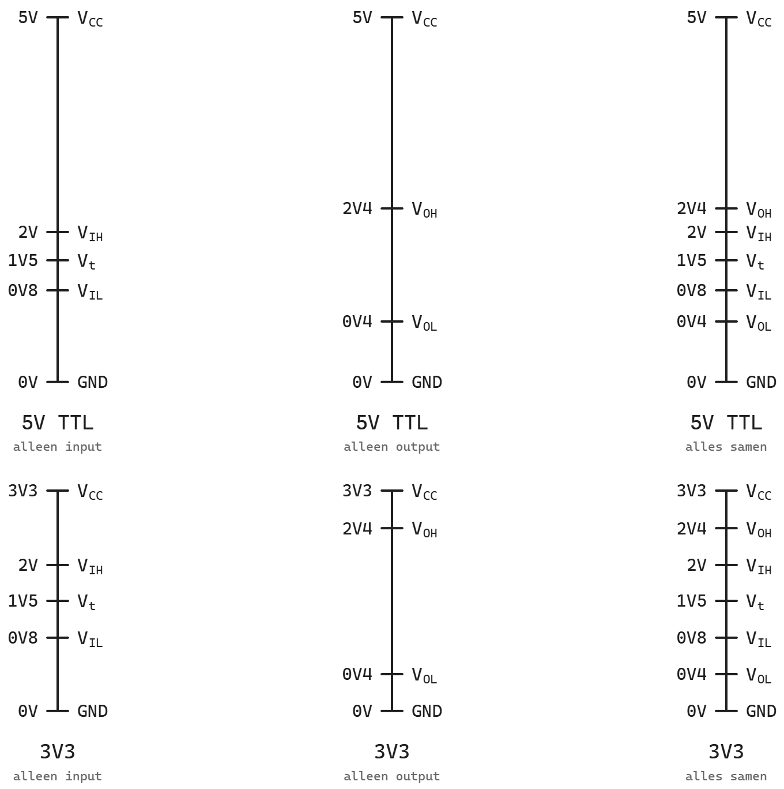
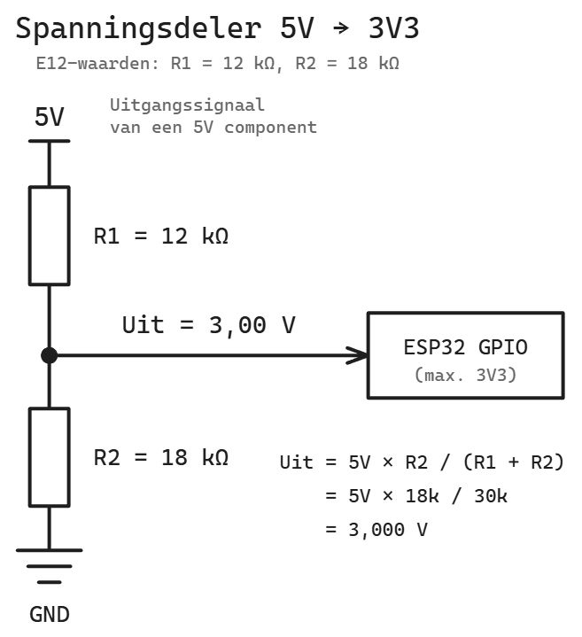
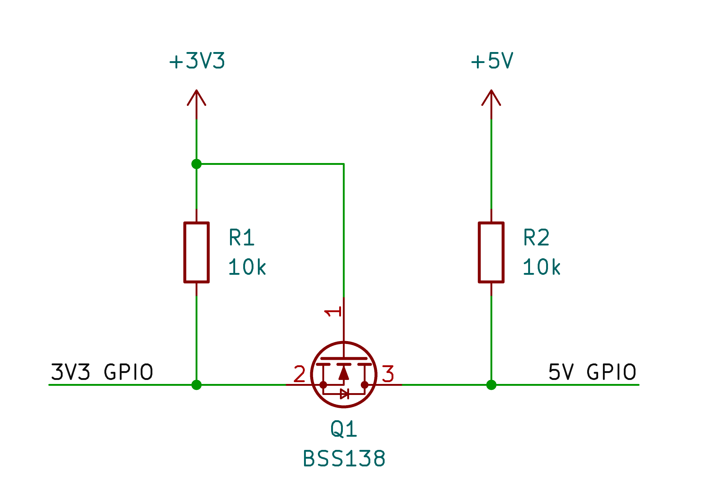
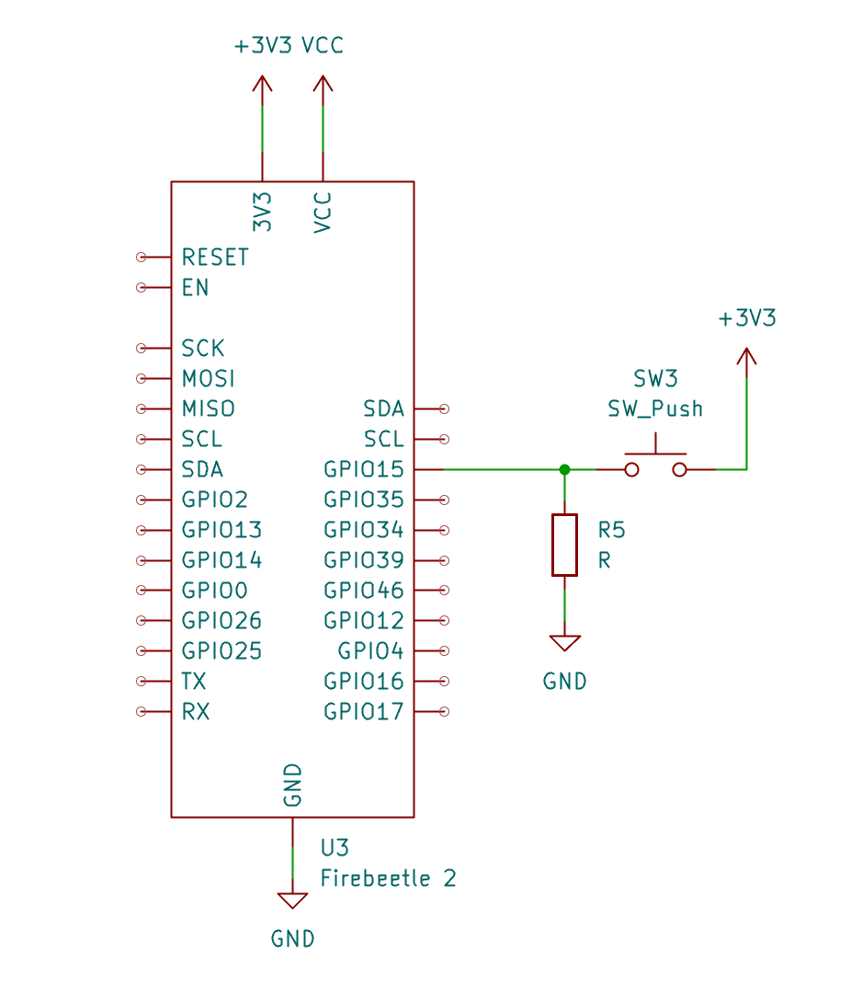
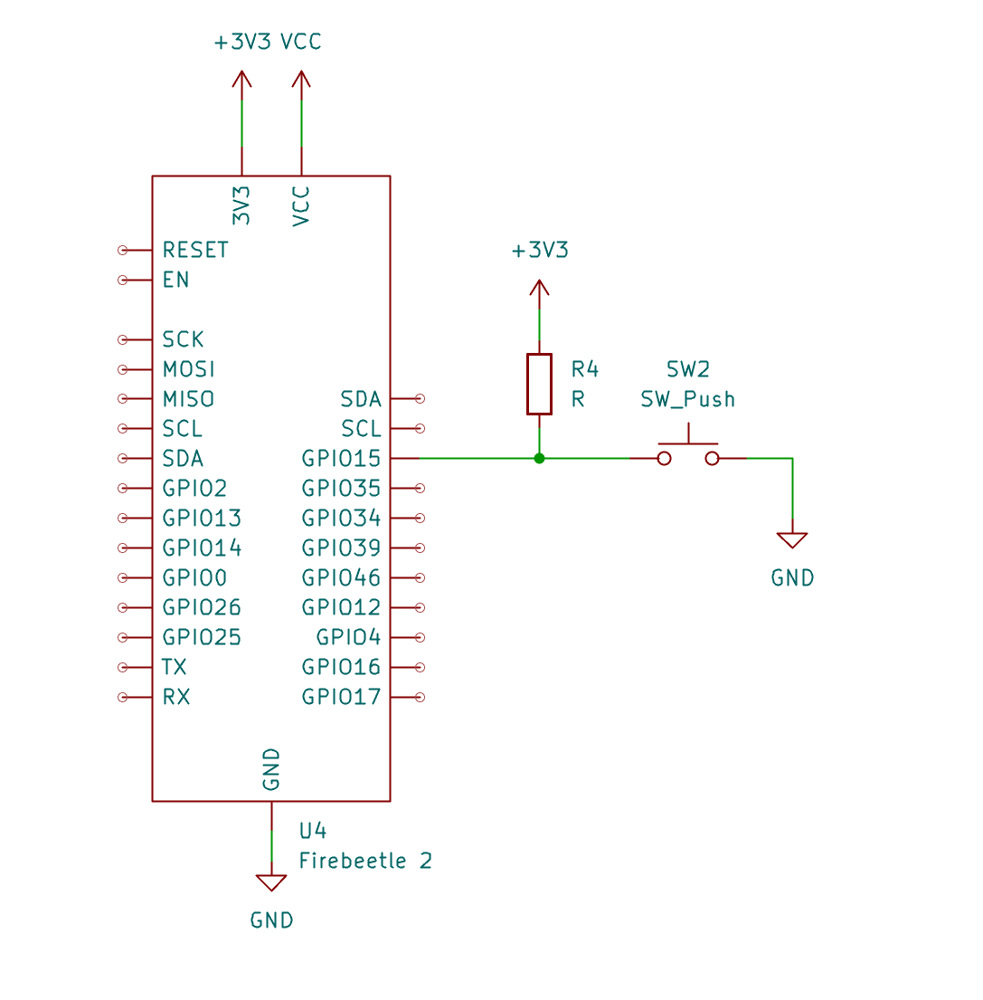
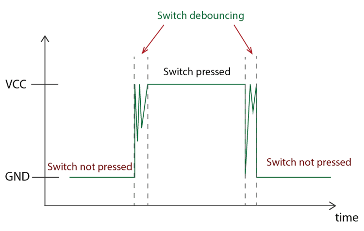
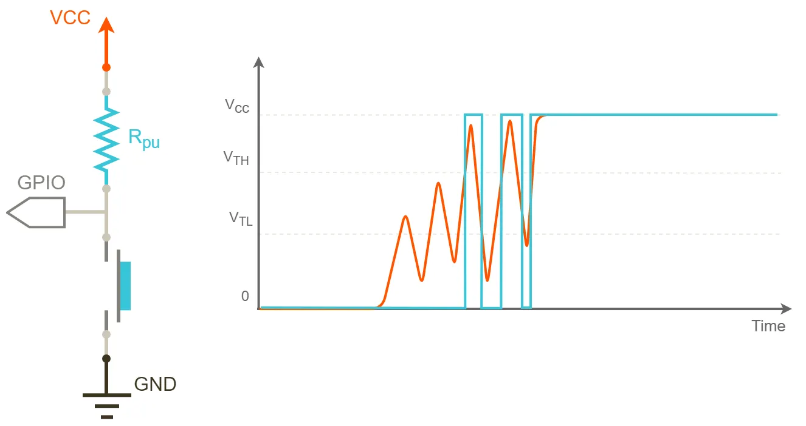
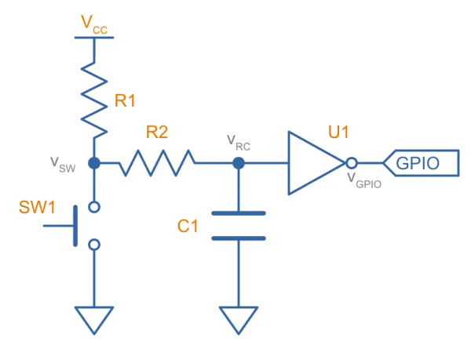
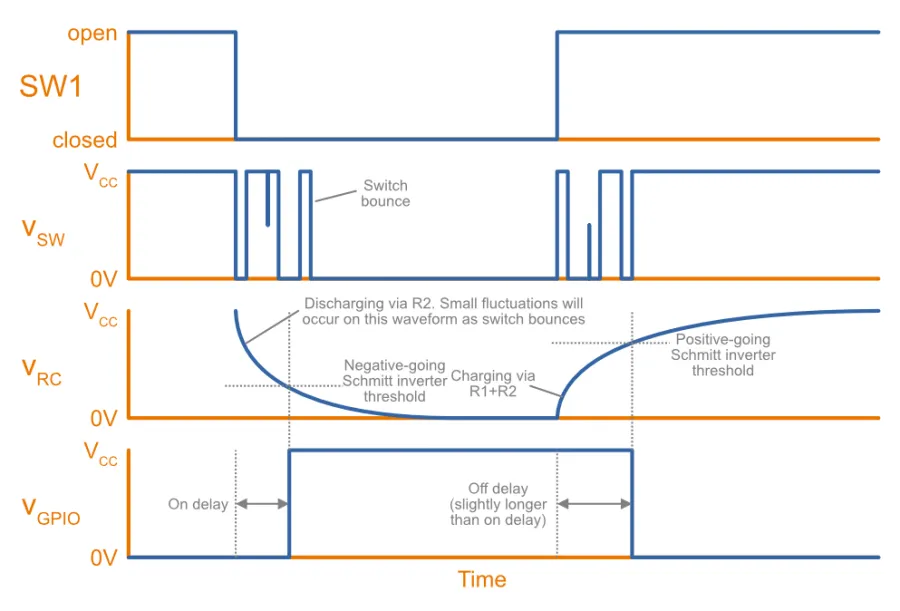

# 4.4 Digitale input

Een digitale ingang lijkt eenvoudig: de pin is `HIGH` of `LOW`, 1 of 0. Toch
is de werkelijkheid aan de buitenkant van de pin een stuk minder netjes. Wat
binnenkomt, is een **reëel, analoog signaal**: een spanning die in principe
oneindig veel waarden kan aannemen, en die continu kan variëren. Een digitale
ingang moet dat signaal telkens **mappen naar één bit**.

Die vertaling is niet altijd vanzelfsprekend, omdat het externe signaal
onder invloed staat van de omgeving:

- **Ruis en storing**: lange draden, motoren of schakelende voedingen in de
  buurt kunnen extra spanning op de lijn induceren.
- **Een niet-aangesloten ingang**: een pin die nergens mee verbonden is, pikt
  willekeurige spanningen op en "zweeft" tussen HIGH en LOW (zie 4.4.4).
- **Mechanische contacten**: een drukknop maakt niet in één keer contact,
  maar "dendert" een korte tijd tussen open en gesloten (zie 4.4.6).
- **Spanningen tussen HIGH en LOW in**: een signaal dat ergens in het midden
  blijft hangen, valt niet eenduidig in één van beide categorieën (zie 4.4.2).

Deze sectie start bij het eenvoudig uitlezen van een pin, en bouwt daarna
stap voor stap op hoe met deze invloeden omgegaan wordt.

## 4.4.1 Een pin uitlezen

Van een pin die als `INPUT` geconfigureerd is, geeft `digitalRead()` de
huidige toestand terug: `HIGH` of `LOW`.

```cpp
const int sensor_pin = 25;   // D2

void setup() {
  Serial.begin(115200);
  pinMode(sensor_pin, INPUT);
}

void loop() {
  int pin_state = digitalRead(sensor_pin);

  if (pin_state == HIGH) {
    Serial.println("motion detected");
  } else {
    Serial.println("no motion");
  }
  delay(200);
}
```


Een digitale sensor zoals de PIR-bewegingssensor uit 1.4.2 geeft precies
zo'n signaal: HIGH bij beweging, LOW zonder beweging.

Maar wat de pin binnenkrijgt, is altijd een **spanning**, en een spanning kan
eender welke waarde hebben tussen 0 V en 3,3 V. Bij welke spanning beslist de
microcontroller dat het HIGH is?

## 4.4.2 Spanningsniveaus van een digitale GPIO

Een digitale ingang zet een analoge spanning om naar één bit. Daarvoor
gelden vaste grenzen, die in het datasheet van elke chip staan:




| Symbool            | Betekenis                                                                                                    |
| ------------------ | ------------------------------------------------------------------------------------------------------------ |
| **V<sub>OL</sub>** | maximale uitgangsspanning die een component levert voor een LAAG signaal                                     |
| **V<sub>IL</sub>** | maximale ingangsspanning die een component nog als een LAAG signaal beschouwt                                |
| **V<sub>t</sub>**  | drempelspanning (*threshold*) waarbij een component de interpretatie van een signaal wisselt van LAAG naar HOOG, of omgekeerd |
| **V<sub>IH</sub>** | minimale ingangsspanning die een component nog als een HOOG signaal beschouwt                                |
| **V<sub>OH</sub>** | minimale uitgangsspanning die een component levert voor een HOOG signaal                                     |

Tussen V<sub>IL</sub> en V<sub>IH</sub> ligt een **verboden zone**: een
spanning daartussen kan als HIGH of als LOW gelezen worden, en dat kan zelfs
van meting tot meting veranderen.

Voor de ESP32 (op 3,3 V) geeft het datasheet de volgende grenzen:

|                      | Formule    | Op 3,3 V |
| -------------------- | ---------- | -------- |
| V<sub>IH</sub> (min) | 0,75 × VDD | 2,48 V   |
| V<sub>IL</sub> (max) | 0,25 × VDD | 0,83 V   |
| V<sub>OH</sub> (min) | 0,8 × VDD  | 2,64 V   |
| V<sub>OL</sub> (max) | 0,1 × VDD  | 0,33 V   |

## 4.4.3 Spanningsniveaus combineren
### Een 5V signaal uitlezen op een 3,3V pin

Veel sensoren en modules werken op 5 V, en leveren dus ook een HIGH van
ongeveer 5 V aan hun uitgang. De GPIO's van de ESP32 zijn echter **niet
5 V-tolerant**: een spanning boven 3,3 V op een ingang kan de pin
beschadigen. Het signaal moet dus eerst naar een veilig niveau gebracht
worden.

De eenvoudigste oplossing is een **spanningsdeler**: twee weerstanden in
serie tussen het 5 V-signaal en GND. De ESP32-pin wordt aangesloten op het
knooppunt tussen beide weerstanden:



Een spanningsdeler werkt enkel in **één richting**: van een 5 V-uitgang naar
een 3,3 V-ingang. Voor communicatie in beide richtingen is een andere
oplossing nodig (zie hieronder).

### Communicatie tussen 3,3V en 5V

Bij heel wat verbindingen gaat het signaal niet in één vaste richting. Bij
seriële communicatie zoals **I²C** sturen zowel de microcontroller als de
sensor dezelfde datalijn aan: eerst stuurt de master een commando, daarna
antwoordt de slave over diezelfde draad. Als beide componenten op een ander
spanningsniveau werken, is een schakeling nodig die in **beide richtingen**
werkt: een **bidirectionele level shifter**.

Een veelgebruikte oplossing bestaat uit slechts één **N-channel MOSFET**
(bijvoorbeeld een BSS138) en twee pull-up-weerstanden per signaallijn:



- De **gate** hangt vast aan de lage voedingsspanning (3,3 V).
- De **source** zit aan de 3,3 V-kant, met een pull-up naar 3,3 V.
- De **drain** zit aan de 5 V-kant, met een pull-up naar 5 V.

De schakeling kent drie toestanden:

1. **Geen van beide kanten trekt de lijn laag.** Source en gate staan allebei
   op 3,3 V, dus V<sub>GS</sub> = 0 V en de MOSFET spert. Elke kant wordt
   door de eigen pull-up hoog getrokken: 3,3 V aan de ene kant, 5 V aan de
   andere kant. Beide lezen een HIGH.
2. **De 3,3 V-kant trekt de lijn laag.** De source gaat naar 0 V, waardoor
   V<sub>GS</sub> = 3,3 V. De MOSFET geleidt en trekt ook de 5 V-kant laag.
3. **De 5 V-kant trekt de lijn laag.** De drain gaat naar 0 V. Via de
   interne *body diode* van de MOSFET zakt de source eerst tot ongeveer
   0,7 V. Daardoor stijgt V<sub>GS</sub> boven de drempelspanning, gaat de
   MOSFET volledig geleiden en wordt ook de 3,3 V-kant laag getrokken.

Deze schakeling werkt omdat geen enkele component de lijn actief hoog
stuurt: een component trekt de lijn enkel **laag**, het hoge niveau komt
altijd van de pull-up-weerstanden. Dat principe heet **open-drain** en is
precies hoe I²C werkt. Daarom is de schakeling bij uitstek geschikt voor
seriële bussen. Ze werkt ook voor andere signalen, zoals UART of een gewone
GPIO, zolang de snelheid beperkt blijft: de pull-up-weerstanden bepalen hoe
snel de lijn terug hoog wordt.

Voor deze oplossing wordt bijna altijd verwezen naar de application note van
**Philips** (nu NXP): *AN97055 – Bi-directional level shifter for I²C-bus and
other systems*. Die beschrijft de schakeling en de werking in detail.

In de praktijk hoeft deze schakeling zelden zelf opgebouwd te worden.
Leveranciers zoals **SparkFun** en **Adafruit** verkopen kleine breakout
bordjes met **vier** van deze MOSFET-schakelingen naast elkaar. Zo'n
bordje volstaat om bijvoorbeeld een volledige I²C-bus (SDA en SCL) en nog
twee extra signalen tussen 3,3 V en 5 V om te zetten.

## 4.4.4 Zwevende ingangen, pull-up en pull-down

Een drukknop lijkt het eenvoudigste digitale signaal: ingedrukt of niet.
Toch volstaat het niet om een knop tussen 3V3 en een GPIO te plaatsen.
Zolang de knop niet ingedrukt is, is de ingang met **niets** verbonden. Zo'n
**zwevende** ingang (*floating input*) pikt ruis en statische lading op en
leest willekeurig HIGH of LOW.

De oplossing is een weerstand die de ingang naar een vaste toestand trekt
zolang de knop niet ingedrukt is:

- **Pull-down**: weerstand naar **GND**, knop naar **3V3**. Niet ingedrukt
  → LOW, ingedrukt → HIGH.
- **Pull-up**: weerstand naar **3V3**, knop naar **GND**. Niet ingedrukt →
  HIGH, ingedrukt → LOW (**omgekeerde logica**).

| Pull-down                                                              | Pull-up                                                            |
| ---------------------------------------------------------------------- | ------------------------------------------------------------------ |
|  |  |

De weerstand is typisch **10 kΩ**: laag genoeg om ruis te onderdrukken, hoog
genoeg om weinig stroom te verbruiken wanneer de knop ingedrukt is
(3,3 V / 10 kΩ = 0,33 mA).

> **Let op:** in de schema's hierboven zit de knop op GPIO15 (A4), een
> strapping pin (zie 4.2.3). Een pull-down op die pin onderdrukt enkel de
> opstartlog. Voor een knop is een pin zonder speciale rol, zoals D2
> (GPIO25), de betere keuze.

**Deze twee schema's moeten van buiten gekend zijn.** Ze komen in elke
schakeling met een knop, schakelaar of open-collector-uitgang terug.

## 4.4.5 Interne pull-up en pull-down

Omdat pull-ups zo vaak nodig zijn, zit er in de meeste microcontrollers een
**interne** pull-up in elke pin, die softwarematig aangezet kan worden. Een
externe weerstand is dan niet meer nodig: de knop komt rechtstreeks tussen de
GPIO en GND.

```cpp
const int button_pin = 25;   // D2
const int led_pin = 2;       // D9, built-in LED

void setup() {
  pinMode(button_pin, INPUT_PULLUP);
  pinMode(led_pin, OUTPUT);
}

void loop() {
  bool is_pressed = digitalRead(button_pin) == LOW;   // pull-up: pressed = LOW
  digitalWrite(led_pin, is_pressed ? HIGH : LOW);
}
```

|                   | Arduino Nano (ATmega328P)     | ESP32                                                          |
| ----------------- | ----------------------------- | -------------------------------------------------------------- |
| Interne pull-up   | ja, `INPUT_PULLUP` (20–50 kΩ) | ja, `INPUT_PULLUP` (ongeveer 45 kΩ)                            |
| Interne pull-down | nee                           | ja, `INPUT_PULLDOWN`                                           |
| Uitzonderingen    | –                             | **GPIO34–39** (A0–A3) hebben geen interne pull-up of pull-down |

Een interne pull-up is relatief zwak (tientallen kΩ). Voor lange draden of
een elektrisch rumoerige omgeving is een externe weerstand van 10 kΩ of
lager robuuster.

## 4.4.6 Drukknoppen zijn niet digitaal

Een schakelaar is een **mechanisch** onderdeel. Bij het indrukken of
loslaten botsen de metalen contacten een paar keer tegen elkaar voor ze
stabiel contact maken: de veer in de knop gaat trillen. Die **contactdender**
(*switch bounce*) duurt typisch enkele milliseconden:



Voor een mens is dat één druk op de knop. Een microcontroller leest een pin
echter duizenden keren per milliseconde uit, en registreert bij één druk
**meerdere pulsen**. Met een pull-up ziet dat er zo uit:



Een programma dat een led wisselt bij elke druk, wisselt ze dan
willekeurig een even of oneven aantal keren. Het wegwerken van dat effect
heet **debouncen**, en kan in hardware of in software.

### Debouncen in hardware

Een **RC-filter** vlakt de snelle schommelingen af: een condensator kan
niet ogenblikkelijk op- of ontladen, dus kortstondige pulsen komen niet tot
aan de drempel. Een **Schmitt-trigger** erachter zorgt voor een zuivere
overgang, omdat die een aparte drempel heeft voor stijgende en dalende
spanning (*hysteresis*).

| Schakeling                                                       | Signalen                                                             |
| ---------------------------------------------------------------- | -------------------------------------------------------------------- |
|  |  |

*Bron: [mbedded.ninja, Switch
Debouncing](https://blog.mbedded.ninja/electronics/circuit-design/debouncing/)*

De tijdsconstante τ = R × C moet duidelijk groter zijn dan de duur van de
dender. Met 10 kΩ en 1 µF is τ = 10 ms, ruim genoeg voor de meeste
drukknoppen. Hardware-debounce kost extra componenten, maar ontlast de
software volledig. Dat is vooral interessant wanneer de knop een
**interrupt** triggert.

### Debouncen in software

Zonder extra componenten kan het ook in code: een verandering wordt pas
aanvaard wanneer de ingang een bepaalde tijd **stabiel** gebleven is. Het
volgende voorbeeld wisselt de led bij elke druk op de knop, en gebruikt
`millis()` om de tijd bij te houden zonder het programma te blokkeren:

```cpp
const int button_pin = 25;               // D2
const int led_pin = 2;                   // D9, built-in LED
const unsigned long debounce_delay_ms = 50;

int led_state = LOW;
int button_state = HIGH;                 // stable state (pull-up: released = HIGH)
int last_reading = HIGH;                 // previous raw reading
unsigned long last_change_ms = 0;

void setup() {
  pinMode(button_pin, INPUT_PULLUP);
  pinMode(led_pin, OUTPUT);
  digitalWrite(led_pin, led_state);
}

void loop() {
  int reading = digitalRead(button_pin);

  if (reading != last_reading) {
    last_change_ms = millis();           // input changed: restart the timer
  }

  if ((millis() - last_change_ms) > debounce_delay_ms) {
    if (reading != button_state) {       // stable long enough and different
      button_state = reading;
      if (button_state == LOW) {         // pressed
        led_state = !led_state;
      }
    }
  }

  digitalWrite(led_pin, led_state);
  last_reading = reading;
}
```

Ook een simpele `delay(50)` na het detecteren van een druk werkt. Dat is een
snelle oplossing, maar niet efficiënt: tijdens die delay kan het programma
niets anders doen.

Over debouncen is al veel geschreven. Enkele goede bronnen:

- [Hackaday, Embed with Elliot: Debounce your noisy
  buttons](https://hackaday.com/2015/12/09/embed-with-elliot-debounce-your-noisy-buttons-part-i/)
- [Jack Ganssle, A Guide to Debouncing](https://www.ganssle.com/debouncing.htm)
- [DigiKey, Switch bounce in mechanical switches and debounce
  circuits](https://forum.digikey.com/t/switch-bounce-in-mechanical-switch-and-debounce-circuit/14231)

## 4.4.7 Use cases

### Een rotary encoder uitlezen

Een **rotary encoder** is een draaiknop zonder aanslag, zoals de
volumeknop van een autoradio. Intern zitten twee schakelaars, **A** en
**B**, die bij het draaien kort na elkaar open en dicht gaan. Aan de
volgorde is de draairichting te zien:

- A verandert **voor** B → draaien in wijzerzin
- B verandert **voor** A → draaien in tegenwijzerzin

Omdat het twee gewone schakelaars zijn, gelden dezelfde regels als bij een
drukknop: elke ingang heeft een **pull-up** nodig, en de signalen **denderen**.
Een RC-filter per kanaal is bij een encoder daarom sterk aangeraden.

```cpp
const int encoder_a_pin = 25;   // D2
const int encoder_b_pin = 26;   // D3

int position = 0;
int last_a = HIGH;

void setup() {
  Serial.begin(115200);
  pinMode(encoder_a_pin, INPUT_PULLUP);
  pinMode(encoder_b_pin, INPUT_PULLUP);
}

void loop() {
  int a = digitalRead(encoder_a_pin);

  if (a != last_a && a == LOW) {            // falling edge on A
    if (digitalRead(encoder_b_pin) == HIGH) {
      position++;                           // clockwise
    } else {
      position--;                           // counterclockwise
    }
    Serial.println(position);
  }
  last_a = a;
}
```

> **Let op:** de pull-ups van een encoder komen aan **3V3**, niet aan VCC.
> VCC is op de FireBeetle 2 ongeveer 4,7 V, en dat is te veel voor een GPIO
> (zie 4.4.3). Kies ook geen pinnen uit GPIO34–39 als de interne pull-up
> gebruikt wordt: die pinnen hebben er geen.

Wordt er snel gedraaid, dan kan deze polling-aanpak stappen missen. Een
betere aanpak gebruikt **interrupts** of de hardware-pulsteller (PCNT) van
de ESP32.

### Een pulsduur meten

Sommige sensoren geven hun meetwaarde door als de **duur** van een puls. De
HC-SR04 uit 4.3.5 zet zijn `Echo`-uitgang HIGH zolang het geluid onderweg is
(zie de timing daar). `pulseIn()` meet die tijd in microseconden:

```cpp
const int trigger_pin = 26;   // D3
const int echo_pin = 25;      // D2, via a voltage divider!

void setup() {
  Serial.begin(115200);
  pinMode(trigger_pin, OUTPUT);
  pinMode(echo_pin, INPUT);
}

void loop() {
  digitalWrite(trigger_pin, HIGH);
  delayMicroseconds(10);
  digitalWrite(trigger_pin, LOW);

  unsigned long echo_us = pulseIn(echo_pin, HIGH, 30000);   // timeout: 30 ms
  if (echo_us == 0) {
    Serial.println("no echo");
  } else {
    float distance_cm = echo_us * 0.0343 / 2;   // speed of sound, there and back
    Serial.println(distance_cm);
  }
  delay(100);
}
```

> **Let op:** de HC-SR04 werkt op 5 V, en zijn `Echo`-uitgang dus ook. Die
> uitgang moet via een spanningsdeler naar de ESP32 (zie 4.4.3).

## 4.4.8 Onder de motorkap: het ESP-IDF

Net zoals `digitalWrite()` uiteindelijk `gpio_set_level()` aanroept (zie
4.3.6), is `digitalRead()` in de ESP32 Arduino core een dun laagje rond
`gpio_get_level()` uit het ESP-IDF. Ook `pinMode(sensor_pin, INPUT)` vult
achter de schermen een configuratiestruct in en roept `gpio_config()` aan.

Het PIR-voorbeeld uit 4.4.1 rechtstreeks in het ESP-IDF:

```c
#include "driver/gpio.h"
#include "freertos/FreeRTOS.h"
#include "freertos/task.h"

#define SENSOR_GPIO GPIO_NUM_25   // D2

void app_main(void) {
  gpio_config_t sensor_config = {
    .pin_bit_mask = 1ULL << SENSOR_GPIO,
    .mode = GPIO_MODE_INPUT,
    .pull_up_en = GPIO_PULLUP_DISABLE,
    .pull_down_en = GPIO_PULLDOWN_DISABLE,
    .intr_type = GPIO_INTR_DISABLE,
  };
  ESP_ERROR_CHECK(gpio_config(&sensor_config));

  while (1) {
    int pin_state = gpio_get_level(SENSOR_GPIO);

    if (pin_state == 1) {
      printf("motion detected\n");
    } else {
      printf("no motion\n");
    }
    vTaskDelay(pdMS_TO_TICKS(200));
  }
}
```

De opbouw is dezelfde als in 4.3.6. Eén verschil valt op:
`gpio_get_level()` geeft rechtstreeks `0` of `1` terug, en dus **geen**
`esp_err_t` zoals in het patroon uit 3.4.3. De functie doet zelf geen
foutcontrole: de controle gebeurt vooraf, bij `gpio_config()`.

### Interne pull-up

De interne pull-up uit 4.4.5 wordt in dezelfde configuratiestruct
ingesteld als de richting:

```c
gpio_config_t button_config = {
  .pin_bit_mask = 1ULL << GPIO_NUM_25,
  .mode = GPIO_MODE_INPUT,
  .pull_up_en = GPIO_PULLUP_ENABLE,
  .pull_down_en = GPIO_PULLDOWN_DISABLE,
  .intr_type = GPIO_INTR_DISABLE,
};
ESP_ERROR_CHECK(gpio_config(&button_config));

int level = gpio_get_level(GPIO_NUM_25);
```
