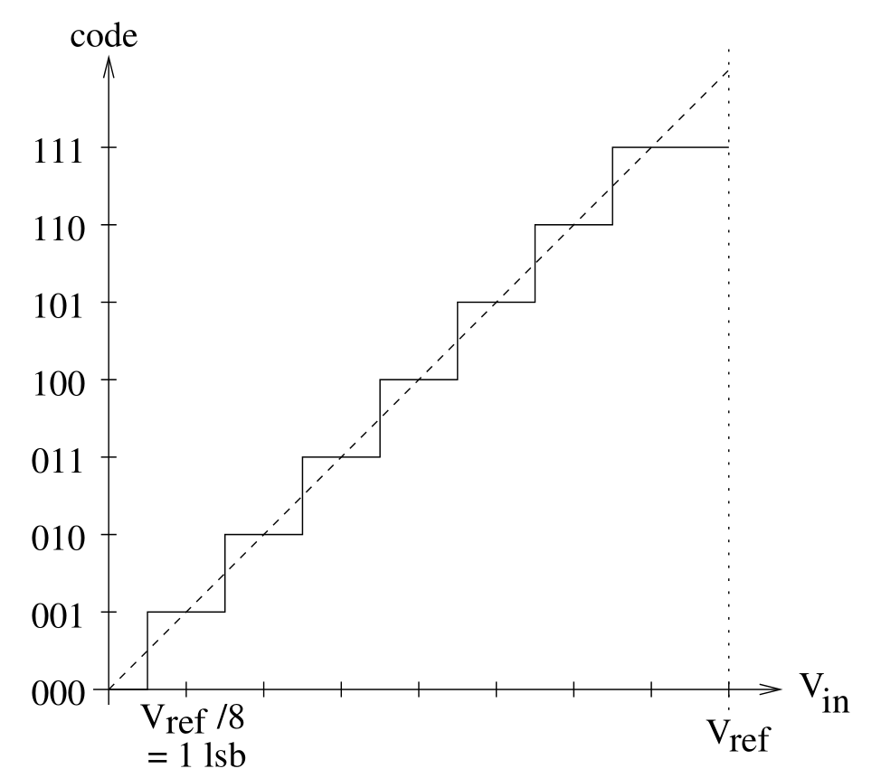

# 4.5 Analoge input

Veel sensoren geven hun meetwaarde als een **spanning**: een potentiometer,
een lichtgevoelige weerstand (LDR) in een spanningsdeler, een analoge
temperatuursensor, de spanning van een batterij, ... Om die spanning in te
lezen, is een **ADC** (*Analog to Digital Converter*) nodig. Die zet een
spanning om naar een getal.

## 4.5.1 Een analoge waarde inlezen

In de Arduino-wereld volstaat `analogRead()`:

```cpp
const int potentiometer_pin = 36;   // A0

void setup() {
  Serial.begin(115200);
}

void loop() {
  int raw = analogRead(potentiometer_pin);   // 0 ... 4095 on an ESP32
  Serial.println(raw);
  delay(100);
}
```

Een `pinMode()` is hier niet nodig. Het getal dat terugkomt, is wel niet
meteen een spanning. Wat het betekent, hangt af van de eigenschappen van de
ADC.

## 4.5.2 Eigenschappen van een ADC

### Resolutie

De **resolutie** is het aantal bits waarmee de ADC een meting voorstelt. Een
ADC van *n* bit verdeelt het meetbereik in 2<sup>n</sup> stappen:

| Microcontroller           | Resolutie | Aantal stappen | Bereik van `analogRead()` |
| ------------------------- | --------- | -------------- | ------------------------- |
| Arduino Nano (ATmega328P) | 10 bit    | 1024           | 0 – 1023                  |
| ESP32                     | 12 bit    | 4096           | 0 – 4095                  |

De figuur toont de overdrachtsfunctie van een (sterk vereenvoudigde) 3-bit
ADC. De spanning wordt afgerond naar de dichtstbijzijnde trede van de trap:



De grootte van één trede heet een **LSB** (*least significant bit*):

> LSB = V<sub>ref</sub> / 2<sup>n</sup>

Voor een Nano met een referentie van 5 V is dat 5 V / 1024 ≈ **4,9 mV**. Een
verschil kleiner dan één LSB is voor de ADC onzichtbaar.

### Referentiespanning

De **referentiespanning** (V<sub>ref</sub>) is de spanning die overeenkomt
met de hoogste waarde van de ADC. De omrekening naar een spanning is dus:

> V<sub>in</sub> = raw / (2<sup>n</sup> − 1) × V<sub>ref</sub>

Op een Nano is V<sub>ref</sub> standaard de voedingsspanning, en die komt van
USB. Een USB-poort die 4,8 V in plaats van 5,0 V levert, verschuift dus alle
metingen. Een nauwkeurige meting vraagt een stabiele referentie.

De ESP32 werkt anders: de ADC heeft een interne referentie van ongeveer
1,1 V, en een instelbare **verzwakking** (*attenuation*) aan de ingang
zorgt voor een groter meetbereik. De Arduino-core gebruikt standaard de
grootste verzwakking (11 dB):

| Verzwakking       | Bruikbaar meetbereik (ESP32) |
| ----------------- | ---------------------------- |
| 0 dB              | 100 mV – 950 mV              |
| 2,5 dB            | 100 mV – 1250 mV             |
| 6 dB              | 150 mV – 1750 mV             |
| 11 dB (standaard) | 150 mV – 3100 mV             |

*Bron: [Arduino-ESP32 documentatie,
ADC](https://docs.espressif.com/projects/arduino-esp32/en/latest/api/adc.html)*

Spanningen onder 150 mV en boven ongeveer 3,1 V kan de ESP32 dus niet
betrouwbaar meten, ook al werkt de chip op 3,3 V.

### Nauwkeurigheid

Een hoge resolutie betekent niet automatisch een nauwkeurige meting. Een
ADC heeft altijd:

- **Ruis**: twee metingen van dezelfde spanning geven zelden exact
  hetzelfde getal. De laatste bits schommelen.
- **Offset- en versterkingsfouten**: de trap uit de figuur ligt wat hoger
  of lager, of is wat steiler, dan de ideale lijn.
- **Niet-lineariteit**: de treden zijn niet allemaal even groot.

De ADC van de ESP32 staat bekend om zijn niet-lineariteit, vooral aan de
randen van het meetbereik. De referentiespanning verschilt bovendien van chip
tot chip. Espressif meet daarom elke chip in de fabriek op, en slaat
correctiewaarden op in de chip (in de *eFuses*). `analogReadMilliVolts()`
gebruikt die kalibratie en geeft meteen een spanning in millivolt terug:

```cpp
const int battery_pin = 36;   // A0, via a voltage divider
const int sample_count = 16;

void setup() {
  Serial.begin(115200);
}

void loop() {
  uint32_t sum_mv = 0;
  for (int i = 0; i < sample_count; i++) {
    sum_mv += analogReadMilliVolts(battery_pin);
  }
  uint32_t voltage_mv = sum_mv / sample_count;   // averaging reduces noise

  Serial.print("System voltage (mV): ");
  Serial.println(voltage_mv);
  delay(500);
}
```

Zelfs met kalibratie en uitmiddelen schommelt de laatste waarde nog een paar
millivolt:

```text
System voltage (mV): 2789
System voltage (mV): 2788
System voltage (mV): 2790
System voltage (mV): 2792
System voltage (mV): 2789
```

Gebruik voor een spanning dus bij voorkeur `analogReadMilliVolts()`, en
middel een aantal metingen uit. Is er meer nauwkeurigheid nodig, dan is een
externe ADC (bijvoorbeeld via I²C) de betere keuze.

## 4.5.3 Welke pin voor een analoge sensor?

De ESP32 heeft twee ADC's, **ADC1** en **ADC2**, elk vast verbonden met een
aantal pinnen (zie 4.2.1). Er is één belangrijke beperking:

> **Let op:** **ADC2 kan niet gebruikt worden wanneer WiFi actief is.** De
> WiFi-driver gebruikt ADC2 zelf. Voor een IoT-toepassing komen analoge
> sensoren dus altijd op een pin van **ADC1**.

Op de FireBeetle 2 betekent dat:

| Label                            | GPIO                        | ADC-kanaal | Met WiFi |
| -------------------------------- | --------------------------- | ---------- | -------- |
| A0                               | 36                          | ADC1_CH0   | ✔        |
| A1                               | 39                          | ADC1_CH3   | ✔        |
| A2                               | 34                          | ADC1_CH6   | ✔        |
| A3                               | 35                          | ADC1_CH7   | ✔        |
| A4                               | 15                          | ADC2_CH3   | ✘        |
| D2, D3, D5, D6, D7, D9, D12, D13 | 25, 26, 0, 14, 13, 2, 4, 12 | ADC2       | ✘        |

A0 tot A3 zijn bovendien de pinnen die enkel input kunnen zijn (zie 4.2.3).
Ze worden dus voor iets anders zelden gemist: gebruik ze voor analoge
sensoren.

## 4.5.4 Een meting omzetten

De ruwe waarde of de spanning moet meestal nog omgezet worden naar een
fysieke grootheid of een ander bereik. Voor een lineair verband is
`map()` handig. Het volgende voorbeeld zet een potentiometer om naar een
percentage:

```cpp
int raw = analogRead(potentiometer_pin);
int percentage = map(raw, 0, 4095, 0, 100);
```

`map()` werkt enkel met gehele getallen. Voor een sensor met een
omzettingsformule uit het datasheet (zoals de LM35 uit 3.4.2) wordt de
berekening beter zelf uitgeschreven, in `float`.

## 4.5.5 Onder de motorkap: het ESP-IDF

In het ESP-IDF gebeurt een losse meting met de **oneshot**-driver. De
opbouw is dezelfde als bij de GPIO-driver: eerst een configuratiestruct,
dan een functie die een `esp_err_t` teruggeeft en het resultaat via een
**pointer** wegschrijft (zie 3.4.3):

```c
#include "esp_adc/adc_oneshot.h"

void app_main(void) {
  adc_oneshot_unit_handle_t adc1_handle;
  adc_oneshot_unit_init_cfg_t unit_config = {
    .unit_id = ADC_UNIT_1,
  };
  ESP_ERROR_CHECK(adc_oneshot_new_unit(&unit_config, &adc1_handle));

  adc_oneshot_chan_cfg_t channel_config = {
    .atten = ADC_ATTEN_DB_12,        // called 11 dB in older versions
    .bitwidth = ADC_BITWIDTH_DEFAULT,
  };
  ESP_ERROR_CHECK(adc_oneshot_config_channel(adc1_handle, ADC_CHANNEL_0, &channel_config));

  int raw = 0;
  ESP_ERROR_CHECK(adc_oneshot_read(adc1_handle, ADC_CHANNEL_0, &raw));   // A0 = ADC1_CH0
}
```

Opvallend: het ESP-IDF werkt met het **ADC-kanaal** (`ADC_CHANNEL_0`) en
niet met het GPIO-nummer. De pinout uit 4.1.2 is dus ook hier nodig. De
omrekening naar millivolt met de kalibratiewaarden gebeurt in het ESP-IDF
met een aparte *calibration*-driver.
