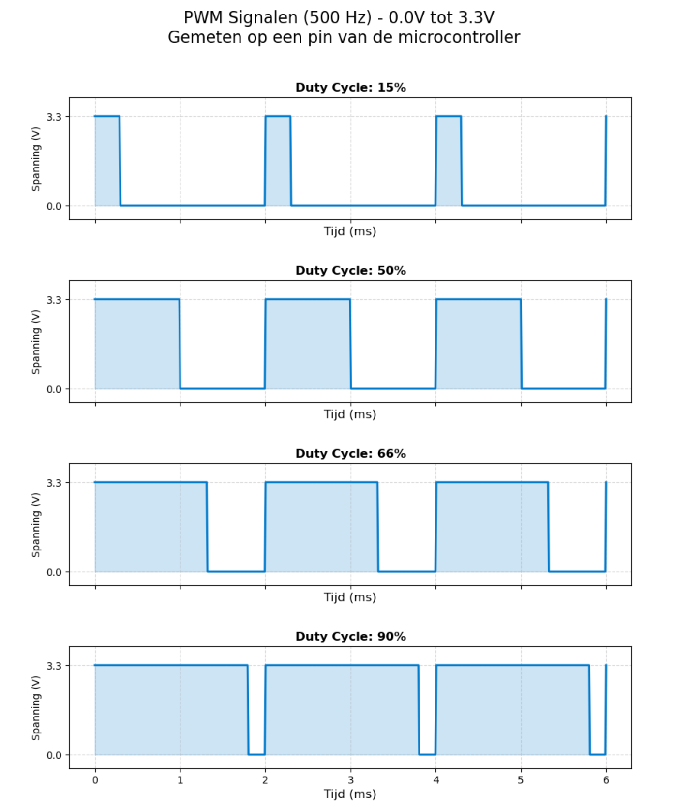

# 4.6 PWM

Een GPIO kent enkel HIGH en LOW (zie 4.1.4). Toch moet een led vaak
gedimd worden, of een motor trager draaien. **PWM** (*Pulse Width
Modulation*) benadert een tussenliggende waarde door de pin heel snel aan en
uit te schakelen.

## 4.6.1 Duty cycle en frequentie

Een PWM-signaal is een blokgolf met twee eigenschappen:

- De **frequentie**: hoe vaak per seconde het signaal een volledige periode
  doorloopt.
- De **duty cycle**: welk deel van elke periode het signaal HIGH is, van 0 %
  (altijd LOW) tot 100 % (altijd HIGH).



De spanning op de pin blijft altijd 0 V of 3,3 V. Een component dat
**traag** reageert ten opzichte van de frequentie, ziet echter enkel het
**gemiddelde**:

> V<sub>gemiddeld</sub> = duty cycle × V<sub>HIGH</sub>

Bij 50 % is dat 1,65 V, bij 90 % ongeveer 3 V. Dat is een vereenvoudiging,
maar in de praktijk werkt het:

- Het **oog** is te traag om een led honderden keren per seconde te zien
  flikkeren, en neemt een gemiddelde helderheid waar.
- Een **motor** heeft massa en inductantie, en reageert op de gemiddelde
  stroom.
- Een echte analoge spanning ontstaat pas met een **RC-laagdoorlaatfilter**
  achter de pin, die het signaal effectief uitmiddelt.

Een PWM-signaal blijft dus een digitaal signaal. Het is geen analoge uitgang,
ook al heet de Arduino-functie `analogWrite()`.

## 4.6.2 analogWrite()

`analogWrite()` verwacht een waarde tussen 0 (0 %) en 255 (100 %), dus met
een resolutie van 8 bit. Het volgende voorbeeld laat een led langzaam
oplichten en weer doven:

```cpp
const int led_pin = 17;   // D10

void setup() {
  pinMode(led_pin, OUTPUT);
}

void loop() {
  for (int fade_value = 0; fade_value <= 255; fade_value += 5) {
    analogWrite(led_pin, fade_value);
    delay(30);
  }

  for (int fade_value = 255; fade_value >= 0; fade_value -= 5) {
    analogWrite(led_pin, fade_value);
    delay(30);
  }
}
```

Op een Arduino Nano werkt `analogWrite()` enkel op de pinnen met een `~`
(D3, D5, D6, D9, D10 en D11), omdat enkel die met een hardware-timer
verbonden zijn (zie de oefening in 4.2.4). Op de ESP32 werkt het op elke
pin die als uitgang kan dienen, dankzij de GPIO matrix (zie 4.2.1).

## 4.6.3 PWM op de ESP32: LEDC

Op de ESP32 genereert de peripheral **LEDC** (*LED Control*) de
PWM-signalen. Ondanks de naam is LEDC geschikt voor elk PWM-signaal, niet
enkel voor leds. De ESP32 heeft 16 LEDC-kanalen, dus maximaal 16 pinnen met
een eigen PWM-signaal.

`analogWrite()` gebruikt LEDC met vaste instellingen: 8 bit resolutie en een
standaardfrequentie van 1 kHz (in versie 3.x van de ESP32-core). Voor een
andere frequentie of een fijnere resolutie biedt de core twee
mogelijkheden:

```cpp
// option 1: adjust analogWrite()
analogWriteFrequency(led_pin, 5000);   // 5 kHz
analogWriteResolution(led_pin, 10);    // 0 ... 1023

// option 2: use the LEDC functions directly
ledcAttach(led_pin, 5000, 10);         // pin, frequency, resolution in bits
ledcWrite(led_pin, 512);               // duty cycle: 512 / 1023 = 50 %
```

Frequentie en resolutie zijn niet onafhankelijk van elkaar: hoe hoger de
frequentie, hoe minder bits resolutie er beschikbaar zijn. De keuze hangt af
van de toepassing:

| Toepassing | Typische frequentie | Waarom                                              |
| ---------- | ------------------- | --------------------------------------------------- |
| Led dimmen | 500 Hz – 5 kHz      | ruim boven wat het oog als flikkering ziet          |
| DC-motor   | 1 kHz – 25 kHz      | boven 20 kHz is het fluiten van de motor onhoorbaar |
| Servomotor | 50 Hz               | de pulsbreedte (1 tot 2 ms) bepaalt de hoek         |
| Buzzer     | 200 Hz – 5 kHz      | de frequentie bepaalt de toon, duty cycle 50 %      |

## 4.6.4 Onder de motorkap: het ESP-IDF

In het ESP-IDF wordt LEDC in twee stappen geconfigureerd. Een **timer**
bepaalt de frequentie en resolutie, een **kanaal** koppelt die timer aan
een pin. Meerdere kanalen kunnen zo dezelfde timer delen.

```c
#include "driver/ledc.h"

#define LED_GPIO 17   // D10

void app_main(void) {
  ledc_timer_config_t timer_config = {
    .speed_mode = LEDC_LOW_SPEED_MODE,
    .duty_resolution = LEDC_TIMER_8_BIT,
    .timer_num = LEDC_TIMER_0,
    .freq_hz = 1000,
    .clk_cfg = LEDC_AUTO_CLK,
  };
  ESP_ERROR_CHECK(ledc_timer_config(&timer_config));

  ledc_channel_config_t channel_config = {
    .gpio_num = LED_GPIO,
    .speed_mode = LEDC_LOW_SPEED_MODE,
    .channel = LEDC_CHANNEL_0,
    .timer_sel = LEDC_TIMER_0,
    .duty = 0,
    .hpoint = 0,
  };
  ESP_ERROR_CHECK(ledc_channel_config(&channel_config));

  ESP_ERROR_CHECK(ledc_set_duty(LEDC_LOW_SPEED_MODE, LEDC_CHANNEL_0, 128));   // 50 %
  ESP_ERROR_CHECK(ledc_update_duty(LEDC_LOW_SPEED_MODE, LEDC_CHANNEL_0));
}
```

Wat `analogWrite()` in één regel doet, vraagt hier een twintigtal regels.
In ruil ligt elke instelling vast in de code, en is zichtbaar welke timer en
welk kanaal in gebruik zijn. In een project met meerdere PWM-signalen is dat
overzicht net nodig.
